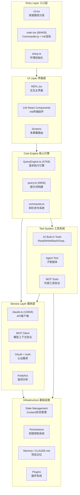
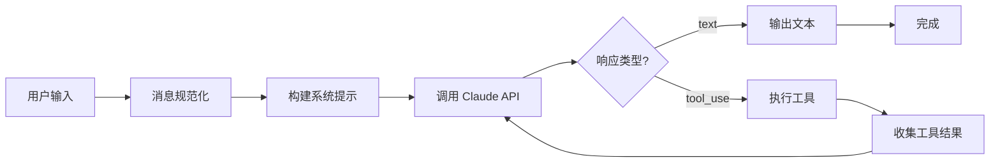

# Claude Code 源码架构全景解析

## 引言

上篇文章我们了解了 Claude Code 的整体定位和核心功能。这篇文章我们将深入源码，从全局视角解析 Claude Code 的六层架构设计。理解架构是后续深入每个模块的基础。

## 六层架构总览

Claude Code 的代码组织遵循清晰的分层原则。从上到下可以划分为六个层次：



接下来逐层拆解。

## Layer 1: Entry Layer 入口层

入口层负责 CLI 参数解析和快速路径分发。核心思想是**尽早分流，按需加载**。

```typescript
// cli.tsx 的快速路径设计（简化）
async function main() {
  const args = process.argv.slice(2);

  // 快速路径：零导入直接返回
  if (args.includes("--version")) {
    console.log(VERSION);
    process.exit(0);
  }

  // 快速路径：headless 模式
  if (args.includes("--print") || args.includes("-p")) {
    const { runHeadless } = await import("./headless");
    return runHeadless(args);
  }

  // 快速路径：特殊运行模式
  if (args.includes("--daemon-worker")) {
    const { startDaemon } = await import("./daemon");
    return startDaemon();
  }

  // 默认路径：加载完整 TUI
  const { startTUI } = await import("./main");
  return startTUI(args);
}
```

关键文件：

| 文件 | 大小 | 职责 |
|------|------|------|
| `cli.tsx` | ~15KB | 入口分发，快速路径 |
| `main.tsx` | 804KB | Commander.js 配置，Ink 渲染启动 |
| `setup.ts` | ~20KB | Node 版本检查，工作目录，权限初始化 |
| `init.ts` | ~25KB | 配置加载，认证，插件初始化 |

## Layer 2: UI Layer 界面层

Claude Code 用 React + Ink 构建终端 UI。这一层包含 144 个 React 组件和多屏幕路由系统。

```typescript
// REPL.tsx 核心结构（简化）
const REPL: React.FC = () => {
  const [messages, setMessages] = useMessages();
  const [input, setInput] = useInput();
  const queryEngine = useQueryEngine();

  const handleSubmit = async (text: string) => {
    // 检查是否是斜杠命令
    if (text.startsWith("/")) {
      return handleSlashCommand(text);
    }
    // 发送给核心引擎
    await queryEngine.execute(text, messages);
  };

  return (
    <Box flexDirection="column" height="100%">
      <MessageList messages={messages} />
      <ToolCallDisplay />
      <InputArea value={input} onSubmit={handleSubmit} />
      <StatusBar />
    </Box>
  );
};
```

UI 层的设计亮点：

- **Hook-Based Composition**: 89 个自定义 Hooks 封装了各类业务逻辑，组件只负责渲染
- **Memoized Context**: 使用 React Context + useMemo 避免不必要的终端重绘
- **Screen Router**: 多屏幕切换机制（主界面、设置、权限确认等）

## Layer 3: Core Engine 核心引擎

这是 Claude Code 的大脑，包含两个最重要的文件：

### QueryEngine.ts（47KB）

请求执行引擎，负责完整的 Agent Loop：



### query.ts（69KB）

提示词构建系统，负责组装发送给 Claude 的完整 prompt。包括系统提示构建、上下文注入、消息裁剪和自动压缩。

### commands.ts

斜杠命令注册和分发系统，管理 60+ 个内置命令如 `/help`、`/model`、`/compact`、`/memory` 等。

## Layer 4: Tool System 工具系统

42 个内置工具是 Claude Code 的四肢。每个工具遵循统一的接口模式：

```typescript
// 工具接口模式（Tool Interface Pattern）
interface ToolDefinition {
  name: string;
  description: string;
  parameters: ZodSchema;       // Zod 运行时校验
  isEnabled: () => boolean;    // 动态启用/禁用
  isReadOnly: () => boolean;   // 是否只读（影响权限检查）
  execute: (params: unknown) => Promise<ToolResult>;
}

// 工具分类
const toolCategories = {
  fileSystem: ["Read", "Write", "Edit", "Glob", "Grep"],
  execution: ["Bash", "Agent"],
  web: ["WebSearch", "WebFetch"],
  notebook: ["NotebookEdit"],
  mcp: ["mcp__*"],  // 动态注册的 MCP 工具
  internal: ["TodoWrite", "ToolSearch"],
};
```

工具系统的设计精妙之处在于 **Feature Flags + Dead Code Elimination（DCE）**。每个工具都有 `isEnabled` 方法，结合构建时 Feature Flags，可以在编译阶段消除未启用的工具代码。

## Layer 5: Service Layer 服务层

服务层处理所有外部通信：

- **claude.ts（126KB）**：最大的单文件，封装了与 Anthropic API 的全部通信逻辑。包括请求构建、流式响应解析、错误处理、重试策略、Token 计数
- **MCP Client**：实现 Model Context Protocol，支持接入外部工具服务器
- **OAuth + Auth**：多种认证方式支持，包括 API Key、OAuth 令牌、环境变量
- **Analytics**：匿名遥测数据收集，可通过配置禁用

## Layer 6: Infrastructure 基础设施

基础设施层提供跨层共享的基础能力：

- **State Management**：基于 Zustand 的状态管理，存储会话状态、配置、权限等
- **Permissions**：精细的权限控制系统，区分只读工具和写入工具，支持用户确认
- **Memory / CLAUDE.md**：项目级记忆系统，通过 CLAUDE.md 文件持久化项目上下文
- **Plugins**：插件系统，支持通过配置文件扩展功能

## 目录结构

```
src/
├── entrypoints/       # 入口层：cli.tsx, main.tsx, setup.ts
├── screens/           # 屏幕组件：各个全屏视图
├── components/        # UI组件：144个React/Ink组件
├── hooks/             # 自定义Hooks：89个
├── state/             # 状态管理：Zustand stores
├── tools/             # 工具系统：42个内置工具
├── services/          # 服务层：API客户端, MCP, OAuth
├── commands/          # 斜杠命令：60+命令定义
├── utils/             # 工具函数
├── types/             # TypeScript 类型定义
└── constants/         # 常量定义
```

## 核心文件尺寸排名

| 排名 | 文件 | 大小 | 层级 |
|------|------|------|------|
| 1 | main.tsx | 804KB | Entry |
| 2 | claude.ts | 126KB | Service |
| 3 | query.ts | 69KB | Core Engine |
| 4 | QueryEngine.ts | 47KB | Core Engine |
| 5 | REPL.tsx | ~35KB | UI |

这些文件的大小反映了各模块承载的逻辑复杂度。`main.tsx` 之所以最大，是因为它包含了 Commander.js 的完整命令定义和大量的配置逻辑。

## 设计理念总结

1. **Feature Flags + DCE**：编译时特性开关，配合 Tree Shaking 消除无用代码
2. **Hook-Based Composition**：通过 Hooks 实现逻辑复用，而非继承
3. **Memoized Context**：React Context 配合 useMemo，在终端场景下优化渲染性能
4. **Tool Interface Pattern**：统一的工具接口，使 42 个工具可插拔、可扩展
5. **Fast Path Dispatch**：入口层尽早分流，避免不必要的模块加载

## 下一步

了解了全局架构之后，下一篇文章我们将跟踪一次完整的启动流程——从 `cli.tsx` 的入口到 `REPL.tsx` 的渲染，看看 Claude Code 是如何在毫秒级内完成初始化并准备好接受你的第一个指令的。
