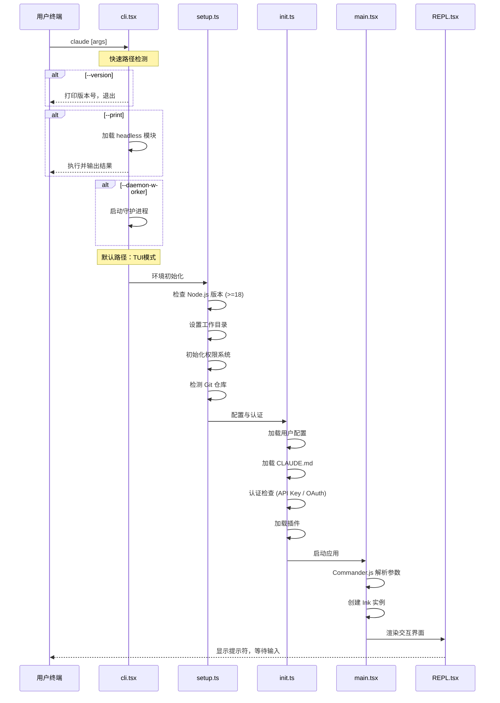

# 从 cli.tsx 到 REPL：Claude Code 启动流程深度剖析

## 引言

当你在终端输入 `claude` 并按下回车，到看到交互式界面准备就绪，中间经历了什么？这个过程涉及 4 个核心文件、十几个初始化步骤和精心设计的快速路径分发机制。

本文将以源码为基础，完整追踪 Claude Code 的启动流程。

## 启动流程全景图



## 第一站：cli.tsx 快速路径分发

`cli.tsx` 是整个应用的入口文件。它的设计哲学是**尽可能快地做完事情返回**。大部分场景根本不需要加载完整的应用框架。

```typescript
// cli.tsx 快速路径设计
#!/usr/bin/env node

const args = process.argv.slice(2);

// ===== 快速路径 1: --version =====
// 零导入。不加载任何模块，直接从 package.json 读取版本号
if (args.includes("--version") || args.includes("-v")) {
  // 直接 require package.json，避免 TypeScript 编译开销
  const pkg = require("../package.json");
  process.stdout.write(pkg.version + "\n");
  process.exit(0);
}

// ===== 快速路径 2: --print (headless模式) =====
// 只加载核心引擎，跳过 UI 层
if (args.includes("--print") || args.includes("-p")) {
  await import("./entrypoints/headless").then((m) =>
    m.runHeadless(args)
  );
  process.exit(0);
}

// ===== 快速路径 3: Chrome Native Host =====
// 浏览器扩展通信协议，独立运行
if (args.includes("--chrome-native-host")) {
  await import("./entrypoints/chrome-native-host").then((m) =>
    m.startNativeHost()
  );
  process.exit(0);
}

// ===== 快速路径 4: Daemon Worker =====
// 后台守护进程模式
if (args.includes("--daemon-worker")) {
  await import("./entrypoints/daemon").then((m) =>
    m.startDaemonWorker()
  );
  process.exit(0);
}

// ===== 快速路径 5: Bridge 模式 =====
// IDE 集成桥接
if (args.includes("--bridge")) {
  await import("./entrypoints/bridge").then((m) =>
    m.startBridge(args)
  );
  process.exit(0);
}

// ===== 默认路径: 完整 TUI =====
// 只有走到这里才会加载 React/Ink 等重型依赖
await import("./entrypoints/main").then((m) => m.startTUI(args));
```

这里的关键优化是**动态 `import()`**。每个分支只加载自己需要的模块，避免了一次性加载整个应用的开销。对于 `--version` 这样的场景，响应时间可以控制在个位数毫秒。

## 第二站：setup.ts 环境初始化

进入 TUI 模式后，第一步是环境初始化。

### Node.js 版本检查

```typescript
// setup.ts - 版本检查
function checkNodeVersion(): void {
  const [major] = process.version.slice(1).split(".").map(Number);
  if (major < 18) {
    console.error(
      `Claude Code requires Node.js >= 18. Current: ${process.version}`
    );
    process.exit(1);
  }
}
```

Claude Code 要求 Node.js 18+，主要是因为依赖了原生 `fetch`、`structuredClone` 等 API。

### 工作目录设置

```typescript
// 确定工作目录
function resolveWorkingDirectory(args: ParsedArgs): string {
  // 优先使用 --cwd 参数
  if (args.cwd) {
    return path.resolve(args.cwd);
  }
  // 否则使用当前目录
  return process.cwd();
}
```

### 权限系统初始化

权限系统是 Claude Code 安全模型的核心。初始化阶段会加载已保存的权限规则：

```typescript
// 权限规则分为三级
interface PermissionConfig {
  // 会话级：本次会话自动允许的操作
  sessionAllowed: PermissionRule[];
  // 项目级：.claude/settings.json 中配置的规则
  projectAllowed: PermissionRule[];
  // 全局级：~/.claude/settings.json 中配置的规则
  globalAllowed: PermissionRule[];
}
```

### Git 仓库检测

```typescript
// 检测当前目录是否在 Git 仓库中
async function detectGitRepo(cwd: string): Promise<GitInfo | null> {
  try {
    const result = await execAsync("git rev-parse --show-toplevel", {
      cwd,
    });
    const root = result.stdout.trim();
    const branch = await execAsync(
      "git rev-parse --abbrev-ref HEAD",
      { cwd }
    );
    return {
      root,
      branch: branch.stdout.trim(),
      isRepo: true,
    };
  } catch {
    return null;
  }
}
```

Git 信息会被注入到系统提示中，让 Claude 知道当前的仓库状态。

## 第三站：init.ts 配置与认证

### 配置加载层级

Claude Code 的配置遵循三级合并策略：

```typescript
// 配置优先级：CLI参数 > 项目配置 > 全局配置 > 默认值
async function loadConfig(): Promise<Config> {
  const defaults = getDefaultConfig();
  const global = await loadGlobalConfig("~/.claude/settings.json");
  const project = await loadProjectConfig(".claude/settings.json");
  const cliArgs = parseCliArgs();

  return deepMerge(defaults, global, project, cliArgs);
}
```

### CLAUDE.md 加载

```typescript
// 搜索并加载 CLAUDE.md 文件
async function loadClaudeMd(cwd: string): Promise<string | null> {
  // 从当前目录向上搜索
  const searchPaths = [
    path.join(cwd, "CLAUDE.md"),
    path.join(cwd, ".claude", "CLAUDE.md"),
    // 继续向上直到 Git 根目录或文件系统根目录
  ];

  for (const filePath of searchPaths) {
    if (await fileExists(filePath)) {
      return fs.readFile(filePath, "utf-8");
    }
  }
  return null;
}
```

### 认证检查

```typescript
// 认证优先级
async function authenticate(): Promise<AuthResult> {
  // 1. 环境变量 ANTHROPIC_API_KEY
  if (process.env.ANTHROPIC_API_KEY) {
    return { type: "api_key", key: process.env.ANTHROPIC_API_KEY };
  }

  // 2. OAuth 令牌缓存
  const cached = await loadCachedOAuthToken();
  if (cached && !isExpired(cached)) {
    return { type: "oauth", token: cached };
  }

  // 3. 交互式 OAuth 流程
  return startOAuthFlow();
}
```

## 第四站：main.tsx Commander.js 与 Ink 启动

`main.tsx` 是最大的源文件（804KB），它负责两件事：

### Commander.js 命令注册

```typescript
import { Command } from "commander";

const program = new Command()
  .name("claude")
  .description("Claude Code - AI编程助手")
  .version(VERSION)
  .option("-p, --print <prompt>", "非交互式执行")
  .option("-c, --continue", "继续上次会话")
  .option("--model <model>", "指定模型")
  .option("--cwd <dir>", "设置工作目录")
  .option("--max-turns <n>", "最大对话轮数")
  .option("--allowedTools <tools...>", "允许的工具列表");

program.parse(process.argv);
```

### Ink 渲染启动

```typescript
import { render } from "ink";
import { App } from "./App";

// 创建 Ink 实例并渲染
const inkInstance = render(
  <AppProviders config={config} auth={auth} gitInfo={gitInfo}>
    <App initialScreen="repl" />
  </AppProviders>,
  {
    exitOnCtrlC: false, // 自行处理 Ctrl+C
  }
);

// 等待应用退出
await inkInstance.waitUntilExit();
```

`AppProviders` 包裹了多层 React Context，提供状态管理、配置、权限等全局服务。

## 第五站：REPL.tsx 交互界面

最终，控制流到达 `REPL.tsx`，渲染交互式界面：

```typescript
const App: React.FC<{ initialScreen: string }> = ({ initialScreen }) => {
  const [screen, setScreen] = useState(initialScreen);

  switch (screen) {
    case "repl":
      return <REPL onNavigate={setScreen} />;
    case "settings":
      return <SettingsScreen onBack={() => setScreen("repl")} />;
    case "permission":
      return <PermissionScreen />;
    default:
      return <REPL onNavigate={setScreen} />;
  }
};
```

此时用户看到提示符，可以开始输入第一条指令。

## 性能优化策略总结

整个启动流程体现了多项性能优化：

1. **快速路径分发**：`--version` 等场景零延迟返回，不加载任何框架代码
2. **动态导入**：每个分支只 `import()` 自己需要的模块
3. **并行初始化**：配置加载、认证检查、Git 检测可以并行执行
4. **延迟加载**：工具定义、MCP 连接等在首次使用时才初始化
5. **缓存复用**：OAuth 令牌、配置文件等都有本地缓存机制

```typescript
// 并行初始化示例
const [config, auth, gitInfo] = await Promise.all([
  loadConfig(),
  authenticate(),
  detectGitRepo(cwd),
]);
```

## 总结

Claude Code 的启动流程设计体现了"**渐进式加载**"的理念。简单场景（如 `--version`）毫秒级返回，复杂场景（TUI 模式）按需加载各个模块。快速路径分发机制确保了不同使用场景的最优启动性能。

下一篇文章，我们将深入 `QueryEngine.ts`，看看当用户提交一个问题后，Claude Code 是如何驱动 Agent Loop 完成从理解到执行的全过程。
