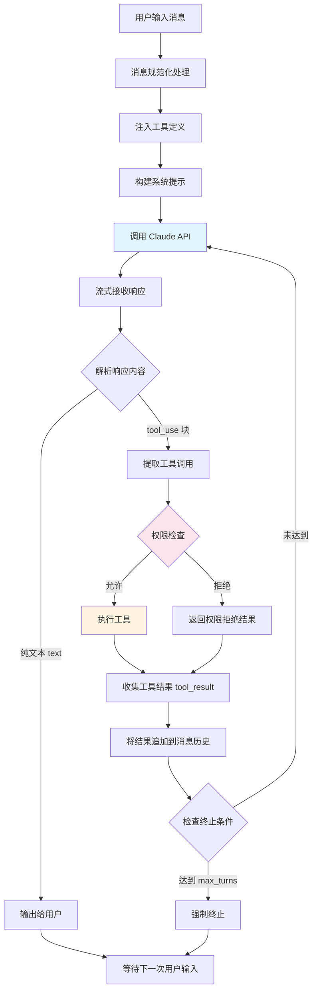
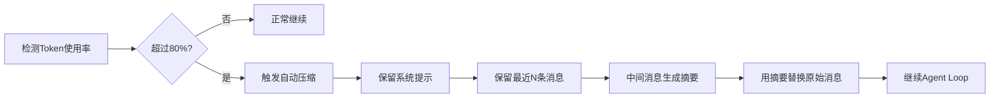

# QueryEngine 源码解读：请求执行引擎的工作原理

## 引言

`QueryEngine.ts` 是 Claude Code 的心脏——一个 46.6KB 的核心文件，负责驱动整个 Agent Loop。当你向 Claude Code 提出一个问题或任务，`QueryEngine` 负责将其转化为 API 请求、解析响应、执行工具调用，并在必要时反复循环直到任务完成。

这篇文章将完整解析这个核心引擎的工作原理。

## QueryEngine 的职责

`QueryEngine` 承担以下核心职责：

1. **消息管理**：维护对话历史，处理消息的添加、规范化和裁剪
2. **API 调用编排**：构建请求参数，调用 Claude API，处理流式响应
3. **Agent Loop 控制**：检测 tool_use 响应，执行工具，回传结果，驱动循环
4. **错误处理**：API 错误分类，重试策略，优雅降级
5. **Token 管理**：上下文窗口监控，触发自动压缩

## Agent Loop：核心执行流程

Agent Loop 是 Claude Code 区别于简单 chatbot 的关键机制。它允许 Claude 自主调用工具、获取结果、再做决策——形成一个"思考-行动-观察"的闭环。



### 核心循环代码结构

```typescript
class QueryEngine {
  private messages: Message[] = [];
  private tools: ToolDefinition[] = [];

  async execute(userMessage: string): Promise<void> {
    // 1. 添加用户消息
    this.messages.push({
      role: "user",
      content: userMessage,
    });

    // 2. Agent Loop
    let turnCount = 0;
    const maxTurns = this.config.maxTurns ?? Infinity;

    while (turnCount < maxTurns) {
      turnCount++;

      // 3. 构建 API 请求
      const request = this.buildRequest();

      // 4. 调用 API（流式）
      const response = await this.callAPI(request);

      // 5. 将助手响应添加到消息历史
      this.messages.push({
        role: "assistant",
        content: response.content,
      });

      // 6. 检查是否有工具调用
      const toolUseBlocks = response.content.filter(
        (block): block is ToolUseBlock => block.type === "tool_use"
      );

      // 7. 没有工具调用 = 对话结束
      if (toolUseBlocks.length === 0) {
        break;
      }

      // 8. 执行所有工具调用
      const toolResults = await this.executeTools(toolUseBlocks);

      // 9. 将工具结果追加到消息历史
      this.messages.push({
        role: "user",
        content: toolResults,
      });

      // 10. 检查是否需要压缩上下文
      if (this.shouldCompact()) {
        await this.compactMessages();
      }

      // 循环继续：带着工具结果再次调用 API
    }
  }
}
```

注意第 7 步的终止条件：**当 Claude 的响应中不包含任何 `tool_use` 块时，Agent Loop 结束**。这意味着 Claude 自己决定何时停止——当它认为任务已完成或需要用户进一步输入时，它会返回纯文本响应。

## 消息处理流程

### 消息规范化

每条消息在进入 Agent Loop 之前都会经过规范化处理：

```typescript
interface NormalizeOptions {
  maxTokens: number;         // 上下文窗口上限
  reservedTokens: number;    // 为系统提示预留的 Token 数
  truncationStrategy: "tail" | "middle"; // 裁剪策略
}

function normalizeMessages(
  messages: Message[],
  options: NormalizeOptions
): Message[] {
  // 1. Token 计数
  const totalTokens = countTokens(messages);

  // 2. 如果超出限制，执行裁剪
  if (totalTokens > options.maxTokens - options.reservedTokens) {
    return truncateMessages(messages, options);
  }

  // 3. 格式规范化
  return messages.map(normalizeMessageFormat);
}
```

### 工具定义注入

在构建 API 请求时，`QueryEngine` 会动态组装工具定义列表：

```typescript
function buildToolDefinitions(): ToolDefinition[] {
  const tools: ToolDefinition[] = [];

  // 内置工具（基于 Feature Flags 过滤）
  for (const tool of builtinTools) {
    if (tool.isEnabled()) {
      tools.push({
        name: tool.name,
        description: tool.description,
        input_schema: zodToJsonSchema(tool.parameters),
      });
    }
  }

  // MCP 工具（来自外部服务器）
  for (const mcpTool of mcpRegistry.getTools()) {
    tools.push(mcpTool.definition);
  }

  return tools;
}
```

## 错误处理体系

`QueryEngine` 的错误处理分为三个层次：

### API 错误分类

```typescript
enum APIErrorType {
  RateLimit = "rate_limit",        // 429: 速率限制
  Overloaded = "overloaded",       // 529: 服务过载
  InvalidRequest = "invalid_request", // 400: 请求格式错误
  Authentication = "authentication",  // 401: 认证失败
  ContextTooLong = "context_too_long", // 上下文超长
  ServerError = "server_error",       // 500: 服务器错误
  NetworkError = "network_error",     // 网络不可达
}
```

### 重试策略

```typescript
interface RetryConfig {
  maxRetries: number;           // 最大重试次数
  baseDelay: number;            // 基础延迟（ms）
  maxDelay: number;             // 最大延迟（ms）
  retryableErrors: APIErrorType[];  // 可重试的错误类型
}

const defaultRetryConfig: RetryConfig = {
  maxRetries: 3,
  baseDelay: 1000,
  maxDelay: 30000,
  retryableErrors: [
    APIErrorType.RateLimit,
    APIErrorType.Overloaded,
    APIErrorType.ServerError,
    APIErrorType.NetworkError,
  ],
};

async function withRetry<T>(
  fn: () => Promise<T>,
  config: RetryConfig
): Promise<T> {
  let lastError: Error;
  for (let attempt = 0; attempt <= config.maxRetries; attempt++) {
    try {
      return await fn();
    } catch (error) {
      lastError = error as Error;
      const errorType = classifyError(error);

      if (!config.retryableErrors.includes(errorType)) {
        throw error; // 不可重试，直接抛出
      }

      // 指数退避 + 抖动
      const delay = Math.min(
        config.baseDelay * Math.pow(2, attempt) + Math.random() * 1000,
        config.maxDelay
      );
      await sleep(delay);
    }
  }
  throw lastError!;
}
```

### 降级处理

当上下文超长时，`QueryEngine` 会自动触发降级：

```typescript
async function handleContextTooLong(): Promise<void> {
  // 策略1：自动压缩消息历史
  const compacted = await compactMessages(this.messages);
  if (countTokens(compacted) < this.contextLimit) {
    this.messages = compacted;
    return;
  }

  // 策略2：裁剪中间消息，保留首尾
  this.messages = truncateMiddle(this.messages, this.contextLimit);
}
```

## Token 管理与自动压缩

### 上下文窗口监控

```typescript
// 每次 API 调用后检查 Token 使用情况
function shouldCompact(): boolean {
  const usage = this.lastResponse?.usage;
  if (!usage) return false;

  const totalUsed = usage.input_tokens + usage.output_tokens;
  const threshold = this.contextWindow * 0.8; // 80% 阈值

  return totalUsed > threshold;
}
```

### 自动压缩触发

当 Token 使用量超过上下文窗口的 80% 时，`QueryEngine` 会自动触发消息压缩：



```typescript
async function compactMessages(): Promise<void> {
  // 保留第一条（系统上下文）和最近的消息
  const preserveFirst = this.messages.slice(0, 1);
  const preserveRecent = this.messages.slice(-6); // 最近3轮对话
  const toSummarize = this.messages.slice(1, -6);

  if (toSummarize.length === 0) return;

  // 使用 Claude 生成摘要
  const summary = await this.summarize(toSummarize);

  // 重组消息列表
  this.messages = [
    ...preserveFirst,
    {
      role: "user",
      content: `[Previous conversation summary: ${summary}]`,
    },
    { role: "assistant", content: "Understood. I have the context." },
    ...preserveRecent,
  ];
}
```

## 工具执行并发控制

当 Claude 在一个响应中返回多个 tool_use 块时，`QueryEngine` 需要决定执行策略：

```typescript
async function executeTools(
  toolUseBlocks: ToolUseBlock[]
): Promise<ToolResultBlock[]> {
  const results: ToolResultBlock[] = [];

  // 区分可并行和必须串行的工具
  const readOnlyTools = toolUseBlocks.filter((t) =>
    getToolDef(t.name)?.isReadOnly()
  );
  const mutatingTools = toolUseBlocks.filter(
    (t) => !getToolDef(t.name)?.isReadOnly()
  );

  // 只读工具可以并行执行
  if (readOnlyTools.length > 0) {
    const parallel = await Promise.all(
      readOnlyTools.map((t) => executeSingleTool(t))
    );
    results.push(...parallel);
  }

  // 写入工具串行执行
  for (const tool of mutatingTools) {
    const result = await executeSingleTool(tool);
    results.push(result);
  }

  return results;
}
```

只读工具（如 Read、Glob、Grep）可以安全地并行执行以提升性能，而写入工具（如 Write、Edit、Bash）则串行执行以避免竞态条件。

## 总结

`QueryEngine` 的设计体现了几个核心原则：

1. **自主循环**：Agent Loop 让 Claude 能够自主决策、自主执行，直到任务完成
2. **弹性容错**：多层错误处理 + 指数退避重试 + 上下文降级
3. **资源感知**：持续监控 Token 使用，自动压缩避免上下文溢出
4. **性能优化**：只读工具并行执行，减少等待时间

下一篇文章，我们将深入 `query.ts`，解析 Claude Code 是如何构建那个让 Claude 理解你的项目、记住你的偏好、遵守你的规则的系统提示词的。
