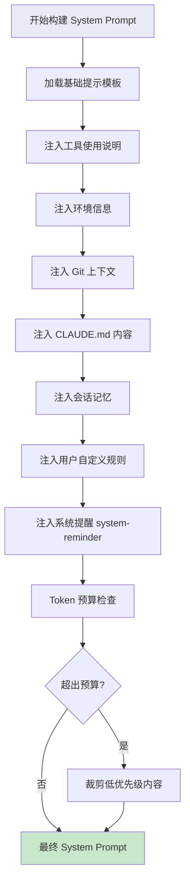

# Claude Code 提示词系统：System Prompt 的构建与优化

## 引言

`query.ts` 是 Claude Code 中第二大核心文件（68.7KB），它的核心使命只有一个：**构建发送给 Claude 的完整请求**。其中最关键的部分是 System Prompt 的组装——一个精心设计的流水线，将基础指令、工具说明、项目上下文、用户偏好等信息编织成一个完整的提示词。

这篇文章将深入解析这个提示词构建系统的每一个环节。

## System Prompt 构建流水线

Claude Code 的 System Prompt 不是一个静态字符串，而是一个动态构建的产物。每次 API 调用前，系统都会根据当前上下文重新组装。



## 第一层：基础提示模板

基础提示定义了 Claude 在 Claude Code 中的角色和行为规范：

```typescript
function buildBasePrompt(): string {
  return `You are Claude Code, Anthropic's official CLI for Claude, \
running within the Claude Agent SDK. You are an interactive CLI tool \
that helps users with software engineering tasks.

Your core capabilities include:
- Reading, searching, and editing files in the codebase
- Executing shell commands and analyzing output
- Managing git operations (commits, branches, PRs)
- Multi-step reasoning and task decomposition

Guidelines:
- Always prefer editing existing files over creating new ones
- Use absolute file paths, never relative paths
- When making changes, verify correctness by reading the result
- For file searches, use Glob and Grep tools instead of shell commands
- Be thorough: check multiple locations when searching for code`;
}
```

这个基础提示看似简单，但每条规则都来自大量的真实使用经验。比如"使用绝对路径"这条规则，就是因为 Agent 的工作目录可能在多次 Bash 调用之间被重置。

## 第二层：工具使用说明

每个工具的详细使用说明会被注入到提示中。这不仅仅是参数描述，还包括使用技巧和注意事项：

```typescript
function buildToolInstructions(tools: ToolDefinition[]): string {
  const sections: string[] = [];

  for (const tool of tools) {
    sections.push(`## ${tool.name}
${tool.description}

Parameters:
${formatParameters(tool.input_schema)}

${tool.usageNotes ?? ""}`);
  }

  return `# Available Tools

You have access to the following tools:

${sections.join("\n\n")}

Important tool usage rules:
- For file searches: use Glob (NOT find or ls)
- For content searches: use Grep (NOT grep or rg)
- For reading files: use Read (NOT cat/head/tail)
- For editing files: use Edit (NOT sed/awk)
- For writing files: use Write (NOT echo >/cat <<EOF)`;
}
```

注意最后的"Important tool usage rules"——这是在引导 Claude 优先使用内置工具而不是通过 Bash 工具执行等效的 shell 命令。内置工具有更好的错误处理、权限控制和输出格式化。

## 第三层：环境信息注入

```typescript
function buildEnvironmentContext(): string {
  const info = {
    workingDirectory: process.cwd(),
    platform: process.platform,
    shell: process.env.SHELL ?? "unknown",
    osVersion: getOSVersion(),
    nodeVersion: process.version,
    isGitRepo: gitInfo !== null,
    currentDate: new Date().toISOString().split("T")[0],
  };

  return `# Environment Information
Working directory: ${info.workingDirectory}
Is directory a git repo: ${info.isGitRepo ? "Yes" : "No"}
Platform: ${info.platform}
Shell: ${info.shell}
OS Version: ${info.osVersion}
Current date: ${info.currentDate}`;
}
```

这些信息帮助 Claude 理解运行环境。比如知道是 Linux 还是 macOS 会影响它生成的 shell 命令；知道当前日期可以帮助它判断文档是否过时。

## 第四层：Git 上下文

如果当前目录是 Git 仓库，会注入丰富的版本控制信息：

```typescript
async function buildGitContext(cwd: string): Promise<string> {
  const [branch, status, recentLog] = await Promise.all([
    exec("git rev-parse --abbrev-ref HEAD", { cwd }),
    exec("git status --short", { cwd }),
    exec("git log --oneline -10", { cwd }),
  ]);

  let context = `# Git Context
Current branch: ${branch.trim()}`;

  if (status.trim()) {
    context += `\n\nUncommitted changes:\n${status.trim()}`;
  }

  context += `\n\nRecent commits:\n${recentLog.trim()}`;

  return context;
}
```

这个上下文让 Claude 在执行 Git 操作时有完整的感知。比如它知道当前在哪个分支，有哪些未提交的变更，最近的提交历史是什么样的。

## 第五层：CLAUDE.md 项目记忆

CLAUDE.md 是 Claude Code 最独特的功能之一。它允许你在项目中放置一个 Markdown 文件，作为 Claude 的"项目记忆"：

```typescript
async function buildClaudeMdContext(cwd: string): Promise<string> {
  const claudeMdPaths = await findClaudeMdFiles(cwd);

  if (claudeMdPaths.length === 0) return "";

  const sections: string[] = [];

  for (const filePath of claudeMdPaths) {
    const content = await readFile(filePath, "utf-8");
    const relativePath = path.relative(cwd, filePath);

    sections.push(
      `## Instructions from ${relativePath}\n\n${content}`
    );
  }

  return `# Project Instructions (CLAUDE.md)

The following instructions were provided by the user in CLAUDE.md files:

${sections.join("\n\n")}

IMPORTANT: Follow these instructions carefully as they represent \
project-specific conventions and requirements.`;
}
```

### CLAUDE.md 搜索顺序

```typescript
async function findClaudeMdFiles(cwd: string): Promise<string[]> {
  const paths: string[] = [];

  // 1. 全局级: ~/.claude/CLAUDE.md
  const globalPath = path.join(os.homedir(), ".claude", "CLAUDE.md");
  if (await exists(globalPath)) paths.push(globalPath);

  // 2. 项目根目录（Git root）
  const gitRoot = await getGitRoot(cwd);
  if (gitRoot) {
    const rootPath = path.join(gitRoot, "CLAUDE.md");
    if (await exists(rootPath)) paths.push(rootPath);
  }

  // 3. 当前工作目录（如果与 Git root 不同）
  if (cwd !== gitRoot) {
    const cwdPath = path.join(cwd, "CLAUDE.md");
    if (await exists(cwdPath)) paths.push(cwdPath);
  }

  // 4. .claude 子目录中的变体
  const dotClaudePath = path.join(cwd, ".claude", "CLAUDE.md");
  if (await exists(dotClaudePath)) paths.push(dotClaudePath);

  return paths;
}
```

多级 CLAUDE.md 的设计允许你在不同层级设置不同的指令：全局配置编码风格偏好，项目级配置构建命令和测试流程，子目录级配置模块特定的约定。

## 第六层：会话记忆与系统提醒

除了 CLAUDE.md，Claude Code 还支持动态注入的"系统提醒"（system-reminder），用于在会话中途补充上下文：

```typescript
interface SystemReminder {
  id: string;
  content: string;
  priority: number;     // 优先级，影响裁剪顺序
  source: "plugin" | "mcp" | "internal";
}

function injectSystemReminders(
  basePrompt: string,
  reminders: SystemReminder[]
): string {
  // 按优先级排序
  const sorted = reminders.sort((a, b) => b.priority - a.priority);

  const reminderText = sorted
    .map(
      (r) =>
        `<system-reminder source="${r.source}">\n${r.content}\n</system-reminder>`
    )
    .join("\n\n");

  return `${basePrompt}\n\n${reminderText}`;
}
```

## 消息规范化与 Token 管理

### Token 计数

`query.ts` 使用高效的 Token 计数来管理上下文预算：

```typescript
function countTokensForMessages(messages: Message[]): number {
  let total = 0;

  for (const msg of messages) {
    if (typeof msg.content === "string") {
      total += estimateTokens(msg.content);
    } else if (Array.isArray(msg.content)) {
      for (const block of msg.content) {
        switch (block.type) {
          case "text":
            total += estimateTokens(block.text);
            break;
          case "image":
            total += estimateImageTokens(block);
            break;
          case "tool_use":
            total += estimateTokens(JSON.stringify(block.input));
            break;
          case "tool_result":
            total += estimateTokens(
              typeof block.content === "string"
                ? block.content
                : JSON.stringify(block.content)
            );
            break;
        }
      }
    }
    // 每条消息的元数据开销
    total += 4;
  }

  return total;
}
```

### 消息裁剪策略

当消息总 Token 数接近上下文窗口限制时，`query.ts` 采用智能裁剪：

```typescript
function truncateMessages(
  messages: Message[],
  maxTokens: number
): Message[] {
  // 永远保留的消息
  const pinned = {
    first: messages[0],         // 第一条用户消息（任务定义）
    recent: messages.slice(-4), // 最近 2 轮对话
  };

  // 中间消息按重要性排序
  const middle = messages.slice(1, -4);
  const scored = middle.map((msg) => ({
    message: msg,
    score: scoreMessageImportance(msg),
  }));

  // 从低分开始裁剪，直到满足 Token 预算
  scored.sort((a, b) => a.score - b.score);

  let currentTokens =
    countTokensForMessages([pinned.first]) +
    countTokensForMessages(pinned.recent);

  const kept: Message[] = [];
  for (const { message } of scored.reverse()) {
    const msgTokens = countTokensForMessages([message]);
    if (currentTokens + msgTokens <= maxTokens) {
      kept.push(message);
      currentTokens += msgTokens;
    }
  }

  // 按原始顺序重组
  return [pinned.first, ...kept.sort(byOriginalIndex), ...pinned.recent];
}
```

### 自动压缩（Auto-compaction）

自动压缩是 Token 管理的终极手段。当裁剪不足以解决问题时，系统会调用 Claude 自身来压缩对话历史：

```typescript
async function autoCompact(
  messages: Message[],
  contextWindow: number
): Promise<Message[]> {
  const usage = countTokensForMessages(messages);
  const threshold = contextWindow * 0.8;

  if (usage < threshold) return messages;

  // 提取需要压缩的消息段
  const toCompress = messages.slice(1, -6);
  if (toCompress.length < 2) return messages;

  // 使用 Claude 生成摘要
  const summaryResponse = await callClaude({
    system:
      "Summarize the following conversation concisely. " +
      "Preserve: key decisions, file paths mentioned, " +
      "code changes made, errors encountered, and current task state. " +
      "Discard: routine tool calls, intermediate search results, " +
      "redundant information.",
    messages: [
      {
        role: "user",
        content: formatMessagesForSummary(toCompress),
      },
    ],
    max_tokens: 2048,
  });

  const summary = extractText(summaryResponse);

  // 重组消息列表
  return [
    messages[0], // 保留原始任务
    {
      role: "user",
      content: `[Conversation summary]\n${summary}`,
    },
    {
      role: "assistant",
      content:
        "I've reviewed the conversation summary and have the full context. Let me continue.",
    },
    ...messages.slice(-6), // 保留最近消息
  ];
}
```

压缩策略的关键在于**信息保留优先级**：

1. **必须保留**：关键决策、文件路径、代码变更、错误信息、当前任务状态
2. **可以丢弃**：常规工具调用的中间结果、重复信息、探索性搜索结果

## 完整的请求构建流程

将所有部分组合起来，一次完整的 API 请求构建如下：

```typescript
async function buildFullRequest(
  messages: Message[],
  config: Config
): Promise<APIRequest> {
  // 1. 构建系统提示（流水线）
  const systemPrompt = [
    buildBasePrompt(),
    buildToolInstructions(getEnabledTools()),
    buildEnvironmentContext(),
    await buildGitContext(config.cwd),
    await buildClaudeMdContext(config.cwd),
    buildSessionMemory(),
  ]
    .filter(Boolean)
    .join("\n\n---\n\n");

  // 2. 消息规范化
  const normalizedMessages = normalizeMessages(messages, {
    maxTokens: config.contextWindow,
    reservedTokens: estimateTokens(systemPrompt) + 4096,
  });

  // 3. 组装请求
  return {
    model: config.model,
    system: systemPrompt,
    messages: normalizedMessages,
    tools: buildToolDefinitions(),
    max_tokens: config.maxOutputTokens,
    stream: true,
  };
}
```

## 总结

Claude Code 的提示词系统是一个精密的工程：

1. **多层流水线**：从基础模板到项目记忆，层层叠加构建完整上下文
2. **动态适应**：每次请求根据当前环境和会话状态重新构建
3. **预算感知**：持续追踪 Token 使用，在信息完整性和上下文限制之间寻找平衡
4. **智能压缩**：用 Claude 自身的理解能力来压缩对话历史，保留关键信息

理解了提示词系统，你就理解了 Claude Code 为什么能在不同项目中表现出色——它不只是在调用 API，而是在为每一次交互精心构建最优的上下文。
