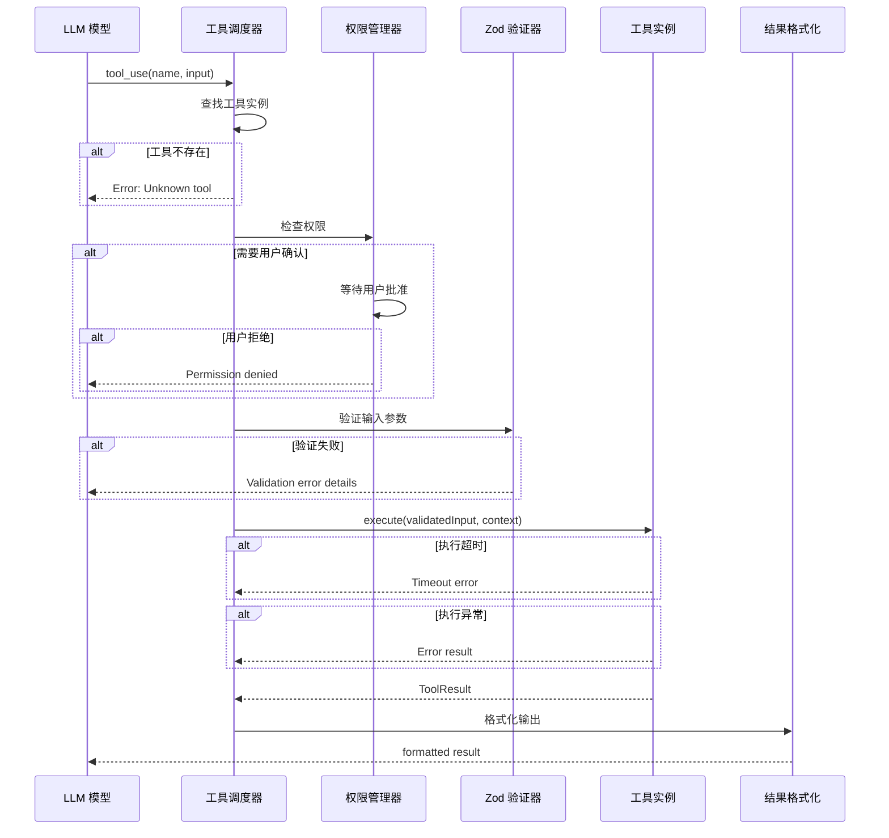

# 深入 Claude Code 工具系统：42个内置工具全解析

Claude Code 的核心竞争力之一，在于其丰富而精心设计的工具系统。42个内置工具覆盖了文件操作、代码执行、内容搜索、子智能体协作、MCP 扩展等多个维度，构成了一个完整的开发辅助工具链。本文将从源码层面深入剖析这套工具系统的架构设计。

## Tool 接口定义

每一个工具都遵循统一的 `Tool` 接口契约。这个接口定义在 `Tool.ts` 中，是整个工具系统的基石：

```typescript
import { z, ZodSchema } from "zod";

export interface ToolResult {
  output: string;
  metadata?: Record<string, unknown>;
  isError?: boolean;
}

export interface Tool<TInput = unknown> {
  // 工具唯一标识符
  name: string;
  
  // 供 LLM 理解的工具描述
  description: string;
  
  // 基于 Zod 的输入参数 schema
  inputSchema: ZodSchema<TInput>;
  
  // 工具执行函数
  execute: (
    input: TInput,
    context: ToolExecutionContext
  ) => Promise<ToolResult>;
  
  // 是否需要用户确认（权限检查）
  requiresPermission?: boolean | ((input: TInput) => boolean);
  
  // 工具所属分类
  category: ToolCategory;
  
  // 是否在当前环境可用
  isAvailable?: () => boolean;
  
  // 参数的用户友好展示
  formatInput?: (input: TInput) => string;
}

export interface ToolExecutionContext {
  workingDirectory: string;
  abortSignal: AbortSignal;
  permissions: PermissionManager;
  onProgress?: (progress: string) => void;
}

export type ToolCategory =
  | "file"
  | "execution"
  | "search"
  | "agent"
  | "mcp"
  | "notebook"
  | "config"
  | "skill";
```

这个设计有几个关键特点：

1. **Zod Schema 验证**：输入参数通过 Zod 进行运行时类型校验，确保 LLM 生成的参数合法
2. **权限分级**：`requiresPermission` 支持布尔值和函数两种形式，实现细粒度权限控制
3. **上下文注入**：`ToolExecutionContext` 提供工作目录、中断信号等运行时信息
4. **进度回调**：`onProgress` 支持长时间运行的工具实时反馈执行状态

## tools.ts 注册中心

`tools.ts`（约 17.3KB）是工具系统的注册中心，负责工具的加载、合并与管理：

```typescript
import { Tool } from "./Tool";
import { fileReadTool } from "./file/FileReadTool";
import { fileEditTool } from "./file/FileEditTool";
import { fileWriteTool } from "./file/FileWriteTool";
import { bashTool } from "./execution/BashTool";
import { agentTool } from "./agent/AgentTool";
// ... 更多工具导入

// 内置工具注册表
const builtinTools: Tool[] = [
  fileReadTool,
  fileEditTool,
  fileWriteTool,
  globTool,
  grepTool,
  bashTool,
  agentTool,
  webSearchTool,
  webFetchTool,
  notebookEditTool,
  todoWriteTool,
  skillTool,
  // ... 共42个内置工具
];

// 工具合并：内置 + MCP + 插件
export function resolveTools(config: ToolConfig): Tool[] {
  const tools: Tool[] = [...builtinTools];
  
  // 加载 MCP 工具
  if (config.mcpServers) {
    const mcpTools = loadMCPTools(config.mcpServers);
    tools.push(...mcpTools);
  }
  
  // 加载插件工具
  if (config.plugins) {
    const pluginTools = loadPluginTools(config.plugins);
    tools.push(...pluginTools);
  }
  
  // 按环境过滤可用工具
  return tools.filter((tool) => {
    if (tool.isAvailable) {
      return tool.isAvailable();
    }
    return true;
  });
}

// 工具名称到实例的映射
export function buildToolMap(tools: Tool[]): Map<string, Tool> {
  const map = new Map<string, Tool>();
  for (const tool of tools) {
    if (map.has(tool.name)) {
      console.warn(`Duplicate tool name: ${tool.name}, later wins`);
    }
    map.set(tool.name, tool);
  }
  return map;
}
```

注册中心采用了三层合并策略：内置工具作为基础层，MCP 工具和插件工具依次叠加。当工具名称冲突时，后注册的工具会覆盖先注册的，这为用户自定义工具行为提供了可能。

## 工具分类体系

42个内置工具按职责划分为以下几个大类：

```mermaid
graph TB
    Root["Claude Code 工具系统<br/>42个内置工具"] --> File["文件操作<br/>File Tools"]
    Root --> Exec["执行工具<br/>Execution Tools"]
    Root --> Search["搜索工具<br/>Search Tools"]
    Root --> AgentCat["智能体工具<br/>Agent Tools"]
    Root --> MCP["MCP 工具<br/>MCP Tools"]
    Root --> Other["其他工具<br/>Other Tools"]
    
    File --> FR["FileRead<br/>文件读取"]
    File --> FE["FileEdit<br/>精确编辑"]
    File --> FW["FileWrite<br/>文件写入"]
    File --> GL["Glob<br/>模式匹配"]
    File --> GR["Grep<br/>内容搜索"]
    
    Exec --> BA["Bash<br/>Shell执行"]
    Exec --> PS["PowerShell<br/>Windows执行"]
    Exec --> RE["REPL<br/>交互式执行"]
    
    Search --> WS["WebSearch<br/>网络搜索"]
    Search --> WF["WebFetch<br/>网页获取"]
    
    AgentCat --> AG["Agent<br/>子智能体"]
    AgentCat --> TK["Task<br/>任务管理"]
    AgentCat --> SM["SendMessage<br/>消息传递"]
    
    MCP --> MT["MCPTool<br/>MCP工具调用"]
    MCP --> MR["Resources<br/>MCP资源"]
    
    Other --> NB["Notebook<br/>Jupyter支持"]
    Other --> TD["Todo<br/>任务追踪"]
    Other --> SK["Skill<br/>技能调用"]
    Other --> CF["Config<br/>配置管理"]

    style Root fill:#6366f1,color:#fff
    style File fill:#3b82f6,color:#fff
    style Exec fill:#ef4444,color:#fff
    style Search fill:#22c55e,color:#fff
    style AgentCat fill:#f59e0b,color:#fff
    style MCP fill:#8b5cf6,color:#fff
    style Other fill:#6b7280,color:#fff
```



### 文件操作工具族

这是最常用的工具组，包含5个工具：

- **FileRead**：支持普通文件、PDF、图片、Jupyter Notebook 的读取，带行号范围控制
- **FileEdit**：基于精确字符串匹配的编辑工具，要求 `old_string` 在文件中唯一
- **FileWrite**：文件写入与创建，强制要求先 Read 后 Write 的安全约束
- **Glob**：基于 glob 模式的文件搜索，结果按修改时间排序
- **Grep**：封装 ripgrep 的高性能内容搜索，支持正则、多行匹配、类型过滤

### 执行工具

- **Bash**：核心的 Shell 命令执行工具，支持沙箱模式、超时控制、后台执行
- **PowerShell**：Windows 环境下的替代方案
- **REPL**：交互式代码执行环境

### 搜索工具

- **WebSearch**：联网搜索能力
- **WebFetch**：获取指定 URL 的网页内容

### 智能体工具

- **Agent**：创建子智能体执行复杂子任务
- **Task**：任务分解与管理
- **SendMessage**：主智能体与子智能体间的消息通信

## 工具执行流程

每个工具调用都经过严格的执行管线：



这个流程的核心要点：

1. **权限前置检查**：在参数验证之前就进行权限检查，避免不必要的计算
2. **Zod 运行时验证**：确保 LLM 生成的 JSON 参数符合工具的 schema 定义
3. **统一错误处理**：无论是权限拒绝、验证失败还是执行异常，都返回结构化的错误信息
4. **结果格式化**：工具的原始输出经过格式化后再返回给 LLM，保证可读性

## 工具注册的扩展模式

工具系统的一个优雅之处在于它的可扩展性。通过 MCP（Model Context Protocol），用户可以无缝接入外部工具：

```typescript
// MCP 工具的动态注册
function loadMCPTools(servers: MCPServerConfig[]): Tool[] {
  const tools: Tool[] = [];
  
  for (const server of servers) {
    const client = createMCPClient(server);
    const serverTools = client.listTools();
    
    for (const mcpTool of serverTools) {
      tools.push({
        name: `mcp__${server.name}__${mcpTool.name}`,
        description: mcpTool.description,
        inputSchema: convertJsonSchemaToZod(mcpTool.inputSchema),
        category: "mcp",
        requiresPermission: true,
        execute: async (input, context) => {
          const result = await client.callTool(mcpTool.name, input);
          return {
            output: formatMCPResult(result),
            metadata: { server: server.name },
          };
        },
      });
    }
  }
  
  return tools;
}
```

MCP 工具名称采用 `mcp__{server}__{tool}` 的命名空间格式，避免与内置工具冲突。所有 MCP 工具默认需要用户权限确认，这是一个重要的安全设计。

## Deferred Tools 机制

为了优化 LLM 的上下文窗口使用，Claude Code 引入了 Deferred Tools（延迟加载工具）机制：

```typescript
// 延迟工具只暴露名称，不包含完整 schema
interface DeferredToolReference {
  name: string;
  // schema 在需要时通过 ToolSearch 获取
}

// ToolSearch 工具负责按需加载完整定义
const toolSearchTool: Tool<{ query: string }> = {
  name: "ToolSearch",
  description: "Fetches full schema definitions for deferred tools",
  inputSchema: z.object({
    query: z.string(),
    max_results: z.number().default(5),
  }),
  execute: async (input, context) => {
    const matched = searchDeferredTools(input.query, input.max_results);
    return {
      output: formatToolDefinitions(matched),
    };
  },
};
```

这种按需加载的设计，使得 Claude Code 可以注册数百个 MCP 工具，而不会占用宝贵的上下文窗口空间。

## 总结

Claude Code 的工具系统体现了几个重要的工程原则：

- **类型安全**：Zod schema 在运行时保证了 LLM 输出的可靠性
- **安全优先**：多层权限检查机制防止了危险操作的意外执行
- **可扩展性**：MCP 协议和插件系统让工具数量可以无限扩展
- **性能优化**：Deferred Tools 机制避免了上下文窗口的浪费

理解工具系统是深入 Claude Code 源码的关键一步。在后续文章中，我们将逐一深入每个重要工具的内部实现。
