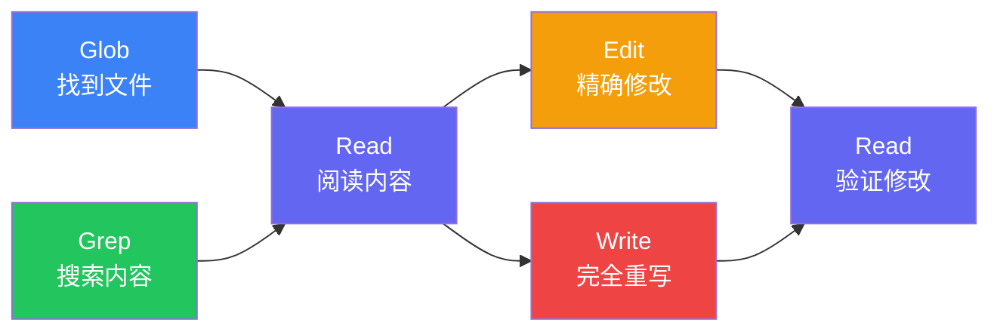

# FileReadTool 与文件操作工具族源码解析

文件操作是 Claude Code 最高频的工具使用场景。五个文件操作工具——FileRead、FileEdit、FileWrite、Glob、Grep——构成了一个完整的文件交互体系。本文将逐一解析它们的源码实现，揭示其中精巧的设计细节。

## FileReadTool：多格式文件读取

FileReadTool 不仅仅是一个 `cat` 命令的封装。它支持普通文本、PDF、图片、Jupyter Notebook 等多种格式，并内置了智能缓存机制。

```typescript
import { z } from "zod";
import { Tool, ToolResult } from "../Tool";
import { readFile } from "fs/promises";
import { extname } from "path";

const readInputSchema = z.object({
  file_path: z.string().describe("The absolute path to the file to read"),
  offset: z.number().min(0).optional().describe("Line number to start reading from"),
  limit: z.number().min(1).optional().describe("Number of lines to read"),
  pages: z.string().optional().describe("Page range for PDF files (e.g., '1-5')"),
});

// 文件内容缓存：避免重复读取同一文件
const fileCache = new Map<string, { content: string; mtime: number }>();

async function readWithCache(filePath: string): Promise<string> {
  const stat = await fs.stat(filePath);
  const cached = fileCache.get(filePath);
  
  if (cached && cached.mtime === stat.mtimeMs) {
    return cached.content;
  }
  
  const content = await readFile(filePath, "utf-8");
  fileCache.set(filePath, {
    content,
    mtime: stat.mtimeMs,
  });
  
  return content;
}

// 为每一行添加行号（模拟 cat -n）
function addLineNumbers(content: string, startLine: number = 1): string {
  const lines = content.split("\n");
  return lines
    .map((line, i) => `${startLine + i}\t${line}`)
    .join("\n");
}

export const fileReadTool: Tool<z.infer<typeof readInputSchema>> = {
  name: "Read",
  description: "Reads a file from the local filesystem.",
  inputSchema: readInputSchema,
  category: "file",
  requiresPermission: false, // 读取不需要权限确认
  
  execute: async (input, context): Promise<ToolResult> => {
    const { file_path, offset, limit, pages } = input;
    const ext = extname(file_path).toLowerCase();
    
    // 根据文件类型分发到不同的读取器
    switch (ext) {
      case ".pdf":
        return readPDF(file_path, pages);
      case ".png":
      case ".jpg":
      case ".jpeg":
      case ".gif":
      case ".webp":
        return readImage(file_path);
      case ".ipynb":
        return readNotebook(file_path);
      default:
        return readTextFile(file_path, offset, limit);
    }
  },
};

async function readTextFile(
  filePath: string,
  offset?: number,
  limit?: number
): Promise<ToolResult> {
  const content = await readWithCache(filePath);
  const lines = content.split("\n");
  
  const startLine = offset ?? 0;
  const endLine = limit ? startLine + limit : lines.length;
  const selectedLines = lines.slice(startLine, endLine);
  
  // 默认读取上限为 2000 行
  const effectiveLimit = limit ?? 2000;
  const truncated = selectedLines.length > effectiveLimit;
  const finalLines = truncated
    ? selectedLines.slice(0, effectiveLimit)
    : selectedLines;
  
  const numbered = addLineNumbers(finalLines.join("\n"), startLine + 1);
  
  return {
    output: numbered,
    metadata: {
      totalLines: lines.length,
      readLines: finalLines.length,
      truncated,
    },
  };
}
```

### 缓存策略

缓存以文件路径为 key，以内容和修改时间戳为 value。每次读取前先检查文件的 `mtime`，如果文件未被修改则直接返回缓存内容。这在 LLM 反复引用同一文件时能显著减少 I/O 开销。

### PDF 和图片的特殊处理

```typescript
async function readPDF(filePath: string, pages?: string): Promise<ToolResult> {
  // PDF 文件需要指定页面范围，最多20页
  const pageRange = parsePageRange(pages ?? "1-10");
  
  if (pageRange.end - pageRange.start > 20) {
    return {
      output: "Error: Maximum 20 pages per request. Please specify a narrower range.",
      isError: true,
    };
  }
  
  const pdfContent = await extractPDFText(filePath, pageRange);
  return { output: pdfContent };
}

async function readImage(filePath: string): Promise<ToolResult> {
  // 图片文件以 base64 编码返回，由多模态 LLM 直接理解
  const buffer = await readFile(filePath);
  const base64 = buffer.toString("base64");
  const mimeType = getMimeType(filePath);
  
  return {
    output: `[Image file: ${filePath}]`,
    metadata: {
      type: "image",
      mimeType,
      base64Content: base64,
    },
  };
}
```

图片读取的输出看似只是一个文本占位符，但真正的图片数据通过 `metadata.base64Content` 传递给多模态 LLM。这个设计让文本输出保持简洁，同时不丢失视觉信息。

## FileEditTool：精确字符串替换

FileEditTool 是五个工具中设计最巧妙的一个。它不使用行号定位（行号不稳定），也不使用 diff/patch（LLM 生成的 diff 容易出错），而是采用"精确字符串匹配替换"的方案：

```typescript
const editInputSchema = z.object({
  file_path: z.string(),
  old_string: z.string().describe("The text to replace"),
  new_string: z.string().describe("The replacement text"),
  replace_all: z.boolean().default(false).describe("Replace all occurrences"),
});

export const fileEditTool: Tool<z.infer<typeof editInputSchema>> = {
  name: "Edit",
  description: "Performs exact string replacements in files.",
  inputSchema: editInputSchema,
  category: "file",
  requiresPermission: true,
  
  execute: async (input, context): Promise<ToolResult> => {
    const { file_path, old_string, new_string, replace_all } = input;
    
    // 安全检查：必须先读取过文件
    if (!hasBeenRead(file_path)) {
      return {
        output: "Error: You must use the Read tool to read this file before editing.",
        isError: true,
      };
    }
    
    // 检查 old_string 和 new_string 不能相同
    if (old_string === new_string) {
      return {
        output: "Error: old_string and new_string must be different.",
        isError: true,
      };
    }
    
    const content = await readFile(file_path, "utf-8");
    
    if (!replace_all) {
      // 唯一性检查：old_string 在文件中必须唯一
      const occurrences = countOccurrences(content, old_string);
      
      if (occurrences === 0) {
        return {
          output: "Error: old_string not found in file. Make sure it matches exactly, including whitespace and indentation.",
          isError: true,
        };
      }
      
      if (occurrences > 1) {
        return {
          output: `Error: old_string found ${occurrences} times. Provide more context to make it unique, or use replace_all.`,
          isError: true,
        };
      }
    }
    
    // 执行替换
    const newContent = replace_all
      ? content.replaceAll(old_string, new_string)
      : content.replace(old_string, new_string);
    
    await writeFile(file_path, newContent, "utf-8");
    
    // 清除缓存
    fileCache.delete(file_path);
    
    return {
      output: `Successfully edited ${file_path}`,
      metadata: {
        replacements: replace_all ? countOccurrences(content, old_string) : 1,
      },
    };
  },
};

function countOccurrences(text: string, search: string): number {
  let count = 0;
  let pos = 0;
  while ((pos = text.indexOf(search, pos)) !== -1) {
    count++;
    pos += search.length;
  }
  return count;
}
```

### 唯一性约束的智慧

`old_string` 必须在文件中唯一出现，这个约束看似严格，实际上解决了一个根本问题：当 LLM 说"修改这一行"时，如何确保不会意外修改到其他相同的行？唯一性检查强制 LLM 提供足够多的上下文，使得替换目标精确无误。

当 `old_string` 不唯一时，LLM 有两个选择：
1. 扩大 `old_string` 的范围，包含更多上下文使其唯一
2. 使用 `replace_all: true` 明确表示要替换所有出现

## FileWriteTool：安全的文件写入

FileWriteTool 的核心安全约束是"先读后写"：

```typescript
const writeInputSchema = z.object({
  file_path: z.string(),
  content: z.string().describe("The content to write to the file"),
});

// 记录哪些文件已被读取过
const readHistory = new Set<string>();

export function markAsRead(filePath: string): void {
  readHistory.add(filePath);
}

export function hasBeenRead(filePath: string): boolean {
  return readHistory.has(filePath);
}

export const fileWriteTool: Tool<z.infer<typeof writeInputSchema>> = {
  name: "Write",
  description: "Writes a file to the local filesystem.",
  inputSchema: writeInputSchema,
  category: "file",
  requiresPermission: true,
  
  execute: async (input, context): Promise<ToolResult> => {
    const { file_path, content } = input;
    
    // 如果文件已存在，必须先读取
    const exists = await fileExists(file_path);
    if (exists && !hasBeenRead(file_path)) {
      return {
        output: "Error: This file already exists. You MUST use the Read tool first before overwriting.",
        isError: true,
      };
    }
    
    // 确保父目录存在
    await fs.mkdir(path.dirname(file_path), { recursive: true });
    
    await writeFile(file_path, content, "utf-8");
    fileCache.delete(file_path);
    
    return {
      output: `File created successfully at: ${file_path}`,
    };
  },
};
```

"先读后写"约束的意义在于：确保 LLM 在覆盖文件前了解文件的当前内容，避免因为"以为文件不存在"或"以为文件是空的"而丢失重要数据。

## GlobTool：文件模式匹配

GlobTool 封装了快速文件查找功能：

```typescript
const globInputSchema = z.object({
  pattern: z.string().describe('Glob pattern (e.g., "**/*.ts")'),
  path: z.string().optional().describe("Directory to search in"),
});

export const globTool: Tool<z.infer<typeof globInputSchema>> = {
  name: "Glob",
  description: "Fast file pattern matching tool.",
  inputSchema: globInputSchema,
  category: "file",
  requiresPermission: false,
  
  execute: async (input, context): Promise<ToolResult> => {
    const searchPath = input.path ?? context.workingDirectory;
    
    const files = await fastGlob(input.pattern, {
      cwd: searchPath,
      absolute: true,
      ignore: [
        "**/node_modules/**",
        "**/.git/**",
        "**/dist/**",
        "**/build/**",
      ],
      stats: true, // 获取文件元信息用于排序
    });
    
    // 按修改时间降序排列
    files.sort((a, b) => b.stats!.mtimeMs - a.stats!.mtimeMs);
    
    return {
      output: files.map((f) => f.path).join("\n") || "No files found",
      metadata: { count: files.length },
    };
  },
};
```

结果按修改时间降序排列是一个细致的设计：最近修改的文件通常是 LLM 最关心的。默认忽略 `node_modules`、`.git` 等目录也能显著提升搜索速度。

## GrepTool：基于 ripgrep 的内容搜索

GrepTool 是对 ripgrep（rg）的封装，提供了比原生 `grep` 更强大的搜索能力：

```typescript
const grepInputSchema = z.object({
  pattern: z.string().describe("Regex pattern to search for"),
  path: z.string().optional(),
  glob: z.string().optional().describe('File filter (e.g., "*.ts")'),
  type: z.string().optional().describe("File type (e.g., 'js', 'py')"),
  output_mode: z.enum(["content", "files_with_matches", "count"]).default("files_with_matches"),
  multiline: z.boolean().default(false),
  "-i": z.boolean().optional().describe("Case insensitive"),
  "-n": z.boolean().default(true).describe("Show line numbers"),
  "-A": z.number().optional().describe("Lines after match"),
  "-B": z.number().optional().describe("Lines before match"),
  "-C": z.number().optional().describe("Context lines"),
  head_limit: z.number().default(250),
  offset: z.number().default(0),
});

export const grepTool: Tool<z.infer<typeof grepInputSchema>> = {
  name: "Grep",
  description: "A powerful search tool built on ripgrep.",
  inputSchema: grepInputSchema,
  category: "file",
  requiresPermission: false,
  
  execute: async (input, context): Promise<ToolResult> => {
    const args = buildRipgrepArgs(input);
    const searchPath = input.path ?? context.workingDirectory;
    
    const result = await executeRipgrep(args, searchPath);
    
    // 应用分页：offset + head_limit
    const lines = result.split("\n");
    const paged = lines.slice(input.offset, input.offset + input.head_limit);
    
    return {
      output: paged.join("\n") || "No matches found",
      metadata: {
        totalMatches: lines.length,
        showing: paged.length,
        offset: input.offset,
      },
    };
  },
};

function buildRipgrepArgs(input: z.infer<typeof grepInputSchema>): string[] {
  const args: string[] = [input.pattern];
  
  if (input.output_mode === "files_with_matches") {
    args.push("-l"); // 只输出文件名
  } else if (input.output_mode === "count") {
    args.push("-c"); // 输出匹配计数
  }
  
  if (input.multiline) {
    args.push("-U", "--multiline-dotall");
  }
  
  if (input["-i"]) args.push("-i");
  if (input["-n"]) args.push("-n");
  if (input["-A"]) args.push("-A", String(input["-A"]));
  if (input["-B"]) args.push("-B", String(input["-B"]));
  if (input["-C"]) args.push("-C", String(input["-C"]));
  if (input.glob) args.push("--glob", input.glob);
  if (input.type) args.push("--type", input.type);
  
  return args;
}
```

### 三种输出模式

- `files_with_matches`（默认）：只返回匹配文件的路径，适合先定位文件再细读
- `content`：返回匹配的具体行及上下文，适合直接查看代码
- `count`：返回各文件的匹配计数，适合评估修改范围

### 分页机制

`head_limit`（默认250）和 `offset` 参数实现了分页。这在大型代码库搜索时至关重要——一次搜索可能返回数千个结果，分页避免了上下文窗口被搜索结果淹没。

## 五个工具的协作模式

这五个工具之间存在紧密的协作关系：



一个典型的工作流程：

1. 用 **Glob** 找到相关文件（如 `**/*.tsx`）
2. 用 **Grep** 在这些文件中搜索特定模式
3. 用 **Read** 阅读找到的文件内容
4. 用 **Edit** 进行精确修改，或用 **Write** 创建新文件
5. 再次用 **Read** 验证修改结果

这个流程中，Read 既是 Edit/Write 的前置条件（安全约束），也是修改后的验证手段，形成了一个闭环。

## 总结

文件操作工具族的设计体现了 Claude Code 对开发者工作流的深刻理解。每个工具都有明确的职责边界：Glob 负责"在哪里"，Grep 负责"找什么"，Read 负责"看什么"，Edit 负责"改什么"，Write 负责"写什么"。它们通过"先读后写"的安全约束和唯一性检查等机制，在赋能 LLM 的同时保护了用户的代码安全。
