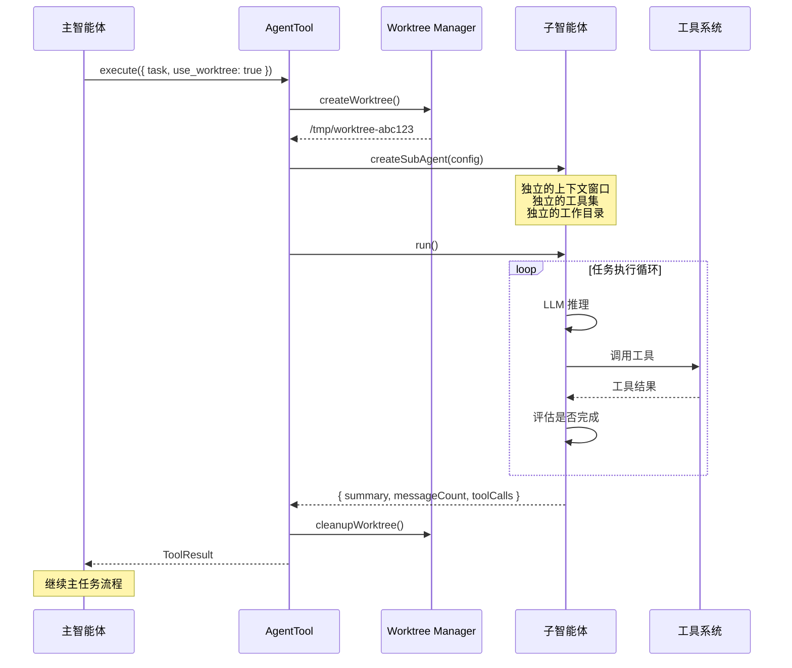
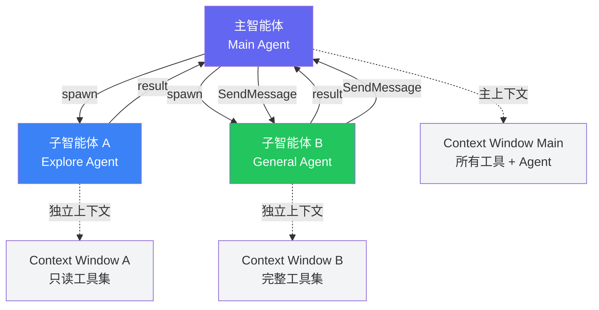

# AgentTool 源码解读：子智能体的诞生与协作

当一个任务过于复杂，单个 LLM 上下文窗口无法有效处理时，Claude Code 的解法是"分而治之"——通过 AgentTool 创建子智能体，让多个独立的 LLM 实例协同工作。本文将深入剖析这套多智能体协作系统的源码实现。

## AgentTool 核心架构

AgentTool 的核心理念是：每个子智能体都是一个完全独立的 Claude Code 实例，拥有自己的上下文窗口、工具集和工作目录。

```typescript
import { z } from "zod";
import { Tool, ToolResult, ToolExecutionContext } from "../Tool";
import { createSubAgent, SubAgent } from "../agent/SubAgent";

const agentInputSchema = z.object({
  task: z.string().describe("Complete task description for the sub-agent"),
  type: z.enum(["general", "explore", "plan", "custom"]).default("general"),
  working_directory: z.string().optional(),
  use_worktree: z.boolean().default(false),
  run_in_background: z.boolean().default(false),
  allowed_tools: z.array(z.string()).optional(),
});

type AgentInput = z.infer<typeof agentInputSchema>;

export const agentTool: Tool<AgentInput> = {
  name: "Agent",
  description: "Creates an independent sub-agent to execute complex tasks.",
  inputSchema: agentInputSchema,
  category: "agent",
  requiresPermission: true,
  
  execute: async (input: AgentInput, context: ToolExecutionContext): Promise<ToolResult> => {
    const {
      task,
      type,
      working_directory,
      use_worktree,
      run_in_background,
      allowed_tools,
    } = input;
    
    // 1. 确定工作目录
    let agentCwd = working_directory ?? context.workingDirectory;
    let worktreePath: string | null = null;
    
    // 2. 如果需要 Worktree 隔离，创建临时副本
    if (use_worktree) {
      worktreePath = await createWorktree(agentCwd);
      agentCwd = worktreePath;
    }
    
    // 3. 构建子智能体配置
    const agentConfig = buildAgentConfig(type, {
      task,
      cwd: agentCwd,
      allowedTools: allowed_tools,
      parentContext: context,
    });
    
    // 4. 创建子智能体
    const subAgent = createSubAgent(agentConfig);
    
    // 5. 执行或后台运行
    if (run_in_background) {
      return launchBackground(subAgent, worktreePath);
    }
    
    const result = await subAgent.run();
    
    // 6. 清理 Worktree
    if (worktreePath) {
      await cleanupWorktree(worktreePath);
    }
    
    return {
      output: result.summary,
      metadata: {
        agentId: subAgent.id,
        messagesUsed: result.messageCount,
        toolCallsCount: result.toolCalls,
      },
    };
  },
};
```

## 子智能体的生命周期

一个子智能体从诞生到完成任务，经历以下完整生命周期：



## 子智能体类型

Claude Code 预定义了几种子智能体类型，每种类型有不同的系统提示和工具集：

```typescript
interface AgentConfig {
  id: string;
  type: string;
  systemPrompt: string;
  task: string;
  cwd: string;
  allowedTools: string[];
  maxTurns: number;
  model?: string;
}

function buildAgentConfig(
  type: string,
  options: AgentOptions
): AgentConfig {
  const baseConfig = {
    id: generateAgentId(),
    task: options.task,
    cwd: options.cwd,
  };
  
  switch (type) {
    case "general":
      return {
        ...baseConfig,
        type: "general",
        systemPrompt: GENERAL_AGENT_PROMPT,
        allowedTools: options.allowedTools ?? ALL_TOOLS,
        maxTurns: 50,
      };
      
    case "explore":
      return {
        ...baseConfig,
        type: "explore",
        systemPrompt: EXPLORE_AGENT_PROMPT,
        // 探索型智能体只有只读工具
        allowedTools: ["Read", "Glob", "Grep", "Bash"],
        maxTurns: 30,
      };
      
    case "plan":
      return {
        ...baseConfig,
        type: "plan",
        systemPrompt: PLAN_AGENT_PROMPT,
        // 规划型智能体侧重分析，不做修改
        allowedTools: ["Read", "Glob", "Grep", "WebSearch"],
        maxTurns: 20,
      };
      
    case "custom":
      return {
        ...baseConfig,
        type: "custom",
        systemPrompt: buildCustomPrompt(options.task),
        allowedTools: options.allowedTools ?? DEFAULT_TOOLS,
        maxTurns: 40,
      };
      
    default:
      throw new Error(`Unknown agent type: ${type}`);
  }
}
```

### 探索型智能体（Explore）

Explore 型智能体专注于代码理解和信息收集。它只配备只读工具（Read、Glob、Grep）和受限的 Bash（用于 `git log` 等安全命令），不能修改任何文件。这使得主智能体可以放心地将"了解代码库结构"或"搜索特定实现"等探索性任务交给它，而无需担心副作用。

### 规划型智能体（Plan）

Plan 型智能体更进一步，连 Bash 都不配备。它的任务是分析问题、制定方案，而不是执行任何操作。这在处理复杂重构任务时特别有用：先让 Plan 智能体制定方案，再由主智能体或 General 子智能体执行。

## Worktree 隔离机制

Git Worktree 是 AgentTool 最精妙的功能之一。它允许子智能体在独立的文件系统副本上工作，不影响主智能体的工作目录。

```typescript
import { execSync } from "child_process";
import { mkdtemp } from "fs/promises";
import { join } from "path";
import { tmpdir } from "os";

async function createWorktree(repoPath: string): Promise<string> {
  // 创建临时目录
  const worktreeBase = await mkdtemp(join(tmpdir(), "claude-worktree-"));
  
  // 获取当前分支信息
  const currentBranch = execSync("git rev-parse --abbrev-ref HEAD", {
    cwd: repoPath,
    encoding: "utf-8",
  }).trim();
  
  const currentCommit = execSync("git rev-parse HEAD", {
    cwd: repoPath,
    encoding: "utf-8",
  }).trim();
  
  // 创建临时分支用于 worktree
  const tempBranch = `claude-agent-${Date.now()}`;
  
  // 基于当前 HEAD 创建 worktree
  execSync(
    `git worktree add -b ${tempBranch} "${worktreeBase}" ${currentCommit}`,
    { cwd: repoPath }
  );
  
  return worktreeBase;
}

async function cleanupWorktree(worktreePath: string): Promise<void> {
  try {
    // 获取 worktree 对应的分支名
    const branchInfo = execSync(
      `git worktree list --porcelain`,
      { cwd: worktreePath, encoding: "utf-8" }
    );
    
    // 提取该 worktree 上的改动（如果需要合并回主分支）
    const hasChanges = execSync(
      "git status --porcelain",
      { cwd: worktreePath, encoding: "utf-8" }
    ).trim().length > 0;
    
    if (hasChanges) {
      // 将改动暂存，供主智能体决定是否采纳
      execSync("git stash", { cwd: worktreePath });
    }
    
    // 移除 worktree
    execSync(`git worktree remove "${worktreePath}" --force`, {
      cwd: worktreePath,
    });
    
    // 删除临时分支
    // (由主进程负责清理)
  } catch (error) {
    console.error("Worktree cleanup failed:", error);
    // 不抛出异常，避免影响主流程
  }
}
```

Worktree 隔离解决了一个关键问题：当子智能体修改文件时，如果直接操作主工作目录，可能与主智能体的操作发生冲突。通过 Worktree，每个子智能体都在独立的文件副本上工作，修改完成后再由主智能体决定是否合并。

## 上下文传递

子智能体虽然独立，但需要从主智能体获取足够的上下文信息：

```typescript
interface SubAgentContext {
  // 完整的任务描述
  task: string;
  
  // 来自主智能体的补充信息
  additionalContext?: string;
  
  // 项目级别的约定（从 CLAUDE.md 等文件获取）
  projectInstructions?: string;
  
  // 工作目录
  cwd: string;
  
  // 父智能体的 ID（用于消息传递）
  parentAgentId?: string;
}

function buildSubAgentSystemPrompt(ctx: SubAgentContext): string {
  let prompt = `You are a sub-agent working on a specific task.\n\n`;
  prompt += `## Your Task\n${ctx.task}\n\n`;
  prompt += `## Working Directory\n${ctx.cwd}\n\n`;
  
  if (ctx.projectInstructions) {
    prompt += `## Project Instructions\n${ctx.projectInstructions}\n\n`;
  }
  
  if (ctx.additionalContext) {
    prompt += `## Additional Context\n${ctx.additionalContext}\n\n`;
  }
  
  prompt += `## Guidelines\n`;
  prompt += `- Focus ONLY on the assigned task\n`;
  prompt += `- Report your findings/results clearly\n`;
  prompt += `- Do not take actions outside the scope of your task\n`;
  
  return prompt;
}
```

注意，子智能体拥有**独立的上下文窗口**。这意味着它不会继承主智能体的对话历史，只获得任务描述和必要的项目信息。这是一个有意为之的设计——保持子智能体的上下文干净，避免被不相关的信息干扰。

## SendMessage 通信机制

主智能体与子智能体之间通过 SendMessage 工具进行异步通信：

```typescript
const sendMessageSchema = z.object({
  agent_id: z.string().describe("Target agent ID"),
  message: z.string().describe("Message content"),
});

export const sendMessageTool: Tool<z.infer<typeof sendMessageSchema>> = {
  name: "SendMessage",
  description: "Send a message to another agent.",
  inputSchema: sendMessageSchema,
  category: "agent",
  
  execute: async (input, context): Promise<ToolResult> => {
    const { agent_id, message } = input;
    
    const targetAgent = AgentRegistry.get(agent_id);
    if (!targetAgent) {
      return {
        output: `Agent ${agent_id} not found or has completed.`,
        isError: true,
      };
    }
    
    // 将消息注入目标智能体的消息队列
    await targetAgent.injectMessage({
      role: "user",
      content: message,
      metadata: {
        from: context.agentId,
        timestamp: Date.now(),
      },
    });
    
    return {
      output: `Message sent to agent ${agent_id}`,
    };
  },
};
```



## 后台执行模式

对于耗时较长的子任务，AgentTool 支持后台执行模式：

```typescript
async function launchBackground(
  subAgent: SubAgent,
  worktreePath: string | null
): Promise<ToolResult> {
  const agentId = subAgent.id;
  
  // 在后台启动子智能体
  const taskPromise = subAgent.run().then(async (result) => {
    // 完成后清理 worktree
    if (worktreePath) {
      await cleanupWorktree(worktreePath);
    }
    
    // 通知主智能体
    notifyAgentComplete(agentId, result);
    
    return result;
  });
  
  // 注册到全局任务跟踪器
  BackgroundTaskRegistry.register(agentId, taskPromise);
  
  return {
    output: `Sub-agent ${agentId} launched in background. You will be notified when it completes.`,
    metadata: {
      agentId,
      isBackground: true,
    },
  };
}
```

后台模式的典型场景是并行处理。例如，主智能体可以同时启动多个子智能体分别处理不同模块的重构，而不需要等待每个子任务依次完成。

## 智能体嵌套与递归限制

子智能体理论上也可以创建自己的子智能体（嵌套智能体），但这需要谨慎控制：

```typescript
const MAX_AGENT_DEPTH = 3;
const MAX_TOTAL_AGENTS = 10;

function checkAgentLimits(context: ToolExecutionContext): boolean {
  const currentDepth = context.agentDepth ?? 0;
  const totalAgents = AgentRegistry.activeCount();
  
  if (currentDepth >= MAX_AGENT_DEPTH) {
    throw new Error(
      `Maximum agent nesting depth (${MAX_AGENT_DEPTH}) reached. ` +
      `Cannot create more sub-agents at this depth.`
    );
  }
  
  if (totalAgents >= MAX_TOTAL_AGENTS) {
    throw new Error(
      `Maximum total agents (${MAX_TOTAL_AGENTS}) reached. ` +
      `Wait for existing agents to complete.`
    );
  }
  
  return true;
}
```

两个维度的限制保证系统不会失控：

- **嵌套深度限制**（默认3层）：防止无限递归
- **总数限制**（默认10个）：防止资源耗尽

## 实际应用场景

### 大规模重构

```typescript
// 主智能体将大型重构分解为多个子任务
const tasks = [
  { task: "Migrate all useState to useReducer in /src/components", cwd: projectRoot },
  { task: "Update all API calls to use the new client", cwd: projectRoot },
  { task: "Fix all TypeScript strict mode errors in /src/utils", cwd: projectRoot },
];

// 并行启动子智能体
for (const t of tasks) {
  await agentTool.execute({
    task: t.task,
    type: "general",
    use_worktree: true,
    run_in_background: true,
  }, context);
}
```

### 代码审查

```typescript
// 使用 Explore 型子智能体进行代码审查
await agentTool.execute({
  task: "Review the changes in the last 5 commits. Focus on security issues, performance bottlenecks, and code style violations. Report findings in a structured format.",
  type: "explore",
  run_in_background: false,
}, context);
```

## 总结

AgentTool 是 Claude Code 架构中最具创新性的组件之一。它将"分治"这一经典计算机科学思想应用到了 AI 辅助编程领域：通过子智能体分解复杂任务，通过 Worktree 实现安全隔离，通过 SendMessage 实现灵活通信。这种多智能体协作模式，使得 Claude Code 能够处理远超单个 LLM 上下文窗口限制的复杂工程任务。
