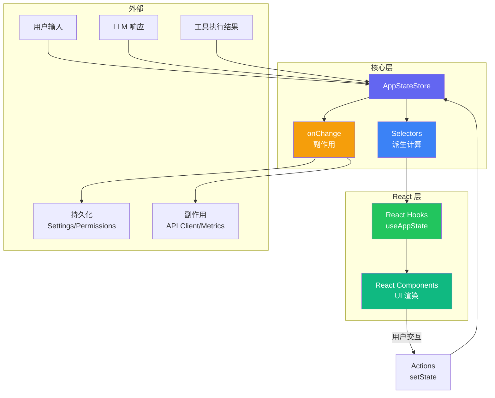

# AppStateStore 架构：Claude Code 状态管理深度研究

状态管理是任何复杂前端应用的核心问题。Claude Code 没有选择 Redux、MobX 或 Zustand 等成熟方案，而是实现了一套轻量级的自研状态管理系统。本文将深入分析这个选择背后的原因，以及实现层面的每个细节。

## 为什么不用 Redux/MobX

在讨论 Claude Code 的状态管理之前，先理解它为什么放弃了主流方案：

**Redux 的问题**：
- 模板代码过多（action types, action creators, reducers）
- 对于 CLI/TUI 应用，Redux DevTools 等生态优势无法发挥
- 中间件系统（thunk, saga）对于 Claude Code 的场景过于复杂

**MobX 的问题**：
- Observable 的魔法行为增加了调试难度
- 装饰器语法在 TypeScript 严格模式下有兼容性问题
- 运行时代理的性能开销在频繁更新场景下不可忽视

**Zustand 最接近，但仍有差距**：
- Zustand 是最轻量的选择，但 Claude Code 需要更深度的定制
- 特别是对 Ink（React CLI 框架）的适配、消息流的增量更新、以及工具执行状态的实时追踪

最终，Claude Code 选择了"类 Zustand"的自研方案：保留 Zustand 的简洁 API 设计，但完全控制内部实现。

## 状态树结构

整个应用状态集中在一棵状态树中，定义在 `AppStateStore.ts`：

```typescript
// AppStateStore.ts

export interface AppState {
  // 消息历史
  messages: Message[];
  
  // 当前活跃的工具调用
  activeToolCalls: Map<string, ToolCallState>;
  
  // 已注册的工具列表
  tools: Tool[];
  
  // 可用的 Skill 列表
  skills: SkillDefinition[];
  
  // 命令历史
  commandHistory: string[];
  
  // 当前模型配置
  model: ModelConfig;
  
  // 运行模式
  mode: AppMode;
  
  // 权限状态
  permissions: PermissionState;
  
  // 用户设置
  settings: UserSettings;
  
  // 会话信息
  session: SessionInfo;
  
  // 主循环状态
  mainLoop: MainLoopState;
  
  // UI 状态
  ui: UIState;
}

export interface Message {
  id: string;
  role: "user" | "assistant" | "system";
  content: MessageContent[];
  timestamp: number;
  metadata?: MessageMetadata;
}

export interface ToolCallState {
  toolName: string;
  input: unknown;
  status: "pending" | "approved" | "executing" | "completed" | "failed";
  result?: ToolResult;
  startTime: number;
  endTime?: number;
}

export interface ModelConfig {
  modelId: string;
  provider: string;
  maxTokens: number;
  temperature: number;
  contextWindow: number;
}

export type AppMode = "interactive" | "oneshot" | "pipe" | "agent";

export interface PermissionState {
  autoApprove: Set<string>;
  sessionApprovals: Map<string, boolean>;
  trustLevel: "ask" | "auto-edit" | "full-auto";
}

export interface UserSettings {
  theme: "dark" | "light" | "auto";
  verbose: boolean;
  notifications: boolean;
  maxTurns: number;
  customInstructions?: string;
}

export interface UIState {
  inputValue: string;
  isLoading: boolean;
  showPermissionDialog: boolean;
  pendingPermission?: PermissionRequest;
  scrollPosition: number;
}
```

这棵状态树有几个设计要点：

1. **扁平化结构**：避免过深的嵌套，每个顶层属性都是一个明确的领域
2. **类型完备**：每个字段都有严格的 TypeScript 类型定义
3. **关注点分离**：UI 状态（`ui`）与业务状态（`messages`、`tools`）明确分离

## Store 创建与更新

`store.ts` 实现了状态存储的核心逻辑：

```typescript
// store.ts

type Listener = () => void;
type Selector<T> = (state: AppState) => T;
type Updater = (state: AppState) => Partial<AppState>;

export function createStore(initialState: AppState): AppStateStore {
  let state = initialState;
  const listeners = new Set<Listener>();
  
  function getState(): AppState {
    return state;
  }
  
  function setState(updater: Updater | Partial<AppState>): void {
    const partial = typeof updater === "function"
      ? updater(state)
      : updater;
    
    const prevState = state;
    state = { ...state, ...partial };
    
    // 只在状态实际变化时通知监听器
    if (state !== prevState) {
      emitChange();
    }
  }
  
  function subscribe(listener: Listener): () => void {
    listeners.add(listener);
    return () => listeners.delete(listener);
  }
  
  function emitChange(): void {
    for (const listener of listeners) {
      listener();
    }
  }
  
  // 批量更新：合并多个 setState 调用，只触发一次通知
  let batchDepth = 0;
  let batchPending = false;
  
  function batch(fn: () => void): void {
    batchDepth++;
    try {
      fn();
    } finally {
      batchDepth--;
      if (batchDepth === 0 && batchPending) {
        batchPending = false;
        emitChange();
      }
    }
  }
  
  return {
    getState,
    setState,
    subscribe,
    batch,
  };
}

export interface AppStateStore {
  getState: () => AppState;
  setState: (updater: Updater | Partial<AppState>) => void;
  subscribe: (listener: Listener) => () => void;
  batch: (fn: () => void) => void;
}
```

### 批量更新机制

`batch` 方法是性能优化的关键。当一个操作需要同时更新多个状态字段时（比如工具执行完成时需要同时更新 `activeToolCalls`、`messages` 和 `ui.isLoading`），使用 `batch` 可以将多次 `setState` 合并为一次通知：

```typescript
store.batch(() => {
  store.setState({ messages: [...messages, newMessage] });
  store.setState((s) => ({
    activeToolCalls: removeToolCall(s.activeToolCalls, callId),
  }));
  store.setState({ ui: { ...ui, isLoading: false } });
});
// 只触发一次重新渲染
```

## Selectors：派生状态计算

`selectors.ts` 定义了从状态树派生计算值的选择器：

```typescript
// selectors.ts

import { AppState, Message, ToolCallState } from "./AppStateStore";

// 基础选择器
export const selectMessages = (state: AppState): Message[] =>
  state.messages;

export const selectActiveToolCalls = (state: AppState): Map<string, ToolCallState> =>
  state.activeToolCalls;

export const selectModel = (state: AppState): ModelConfig =>
  state.model;

// 派生选择器（带记忆化）
export const selectAssistantMessages = memoize(
  (state: AppState): Message[] =>
    state.messages.filter((m) => m.role === "assistant")
);

export const selectPendingToolCalls = memoize(
  (state: AppState): ToolCallState[] =>
    Array.from(state.activeToolCalls.values()).filter(
      (tc) => tc.status === "pending" || tc.status === "approved"
    )
);

export const selectIsProcessing = (state: AppState): boolean =>
  state.mainLoop.isRunning || state.activeToolCalls.size > 0;

export const selectTokenUsage = memoize(
  (state: AppState): { input: number; output: number; total: number } => {
    let input = 0;
    let output = 0;
    for (const msg of state.messages) {
      if (msg.metadata?.tokenCount) {
        if (msg.role === "user") {
          input += msg.metadata.tokenCount;
        } else {
          output += msg.metadata.tokenCount;
        }
      }
    }
    return { input, output, total: input + output };
  }
);

// 简单的记忆化实现
function memoize<T>(selector: (state: AppState) => T): (state: AppState) => T {
  let lastState: AppState | null = null;
  let lastResult: T;
  
  return (state: AppState): T => {
    if (state === lastState) {
      return lastResult;
    }
    lastResult = selector(state);
    lastState = state;
    return lastResult;
  };
}
```

记忆化（memoize）是选择器的关键优化。由于 Claude Code 的消息列表可能很长（数百条消息），如果每次渲染都重新计算 `selectAssistantMessages`，开销会很大。通过检查状态引用是否变化，可以跳过不必要的重新计算。

## React Context 集成

`AppState.tsx` 将 Store 与 React 的 Context 系统连接：

```tsx
// AppState.tsx

import React, { createContext, useContext, useRef, useSyncExternalStore } from "react";
import { AppStateStore, AppState } from "./AppStateStore";
import { createStore } from "./store";

const AppStateContext = createContext<AppStateStore | null>(null);

interface AppStateProviderProps {
  initialState: AppState;
  children: React.ReactNode;
}

export function AppStateProvider({ initialState, children }: AppStateProviderProps) {
  const storeRef = useRef<AppStateStore | null>(null);
  
  if (!storeRef.current) {
    storeRef.current = createStore(initialState);
  }
  
  return (
    <AppStateContext.Provider value={storeRef.current}>
      {children}
    </AppStateContext.Provider>
  );
}

// 核心 Hook：订阅整个 Store
export function useAppStore(): AppStateStore {
  const store = useContext(AppStateContext);
  if (!store) {
    throw new Error("useAppStore must be used within AppStateProvider");
  }
  return store;
}

// 高性能 Hook：只订阅状态的一部分
export function useAppState<T>(selector: (state: AppState) => T): T {
  const store = useAppStore();
  
  return useSyncExternalStore(
    store.subscribe,
    () => selector(store.getState()),
  );
}
```

### useSyncExternalStore 的精妙运用

`useSyncExternalStore` 是 React 18 引入的 Hook，专门用于订阅外部数据源。它解决了两个关键问题：

1. **Tearing（撕裂）防护**：在并发模式下，确保同一次渲染中读到的状态一致
2. **自动退订**：组件卸载时自动清理订阅

结合 selector 模式，组件只会在它关心的状态片段变化时重新渲染：

```tsx
// 这个组件只在 messages 变化时重渲染
function MessageList() {
  const messages = useAppState(selectMessages);
  return <Box>{messages.map(renderMessage)}</Box>;
}

// 这个组件只在 model 变化时重渲染
function ModelIndicator() {
  const model = useAppState(selectModel);
  return <Text>Model: {model.modelId}</Text>;
}
```

## 业务 Hooks

在基础的 `useAppState` 之上，Claude Code 封装了一系列业务 Hooks：

```typescript
// hooks.ts

export function useSettings(): UserSettings {
  return useAppState((s) => s.settings);
}

export function useMainLoopModel(): ModelConfig {
  return useAppState((s) => s.model);
}

export function usePermissions(): PermissionState {
  return useAppState((s) => s.permissions);
}

export function useIsProcessing(): boolean {
  return useAppState(selectIsProcessing);
}

export function useTokenUsage() {
  return useAppState(selectTokenUsage);
}

// 带 dispatch 的 Hook
export function useMessages() {
  const store = useAppStore();
  const messages = useAppState(selectMessages);
  
  const addMessage = React.useCallback(
    (message: Message) => {
      store.setState((s) => ({
        messages: [...s.messages, message],
      }));
    },
    [store]
  );
  
  const clearMessages = React.useCallback(() => {
    store.setState({ messages: [] });
  }, [store]);
  
  return { messages, addMessage, clearMessages };
}
```

## 变更监听：onChangeAppState

`onChangeAppState.ts` 实现了状态变更的副作用系统：

```typescript
// onChangeAppState.ts

type ChangeHandler<T> = (current: T, previous: T) => void;

export function onChangeAppState<T>(
  store: AppStateStore,
  selector: (state: AppState) => T,
  handler: ChangeHandler<T>,
  options?: { equalityFn?: (a: T, b: T) => boolean }
): () => void {
  let previousValue = selector(store.getState());
  const equalityFn = options?.equalityFn ?? Object.is;
  
  return store.subscribe(() => {
    const currentValue = selector(store.getState());
    
    if (!equalityFn(currentValue, previousValue)) {
      const prev = previousValue;
      previousValue = currentValue;
      handler(currentValue, prev);
    }
  });
}

// 使用示例：当权限状态变化时持久化到磁盘
onChangeAppState(
  store,
  (s) => s.permissions,
  (current, previous) => {
    persistPermissions(current);
  }
);

// 当消息列表变化时更新 token 计数
onChangeAppState(
  store,
  (s) => s.messages.length,
  (currentLength, previousLength) => {
    if (currentLength > previousLength) {
      updateTokenMetrics(store.getState().messages);
    }
  }
);

// 当模型配置变化时重新初始化 API 客户端
onChangeAppState(
  store,
  (s) => s.model.modelId,
  (currentModel) => {
    reinitializeAPIClient(currentModel);
  }
);
```

这个副作用系统比 React 的 `useEffect` 更适合处理"状态 A 变化时执行操作 B"的场景，因为它不依赖于 React 的渲染周期，可以立即响应状态变化。

## 状态流转全景

整个状态管理系统的数据流如下：



数据流是严格单向的：

1. **数据源**（用户输入、LLM 响应、工具结果）通过 `setState` 更新 Store
2. **Store** 通知所有订阅者
3. **Selectors** 从状态树中计算派生值
4. **React Hooks** 通过 `useSyncExternalStore` 订阅状态变化
5. **Components** 根据新状态重新渲染
6. **用户交互** 触发新的 `setState`，回到步骤 1

## 性能考量

Claude Code 的状态管理在性能方面有几个值得注意的设计：

```typescript
// 1. 浅合并而非深合并
// setState 只做一层浅合并，避免深拷贝的性能开销
state = { ...state, ...partial };

// 2. 消息列表使用不可变追加
// 新消息总是追加到数组末尾，不修改已有消息
store.setState((s) => ({
  messages: [...s.messages, newMessage],
}));

// 3. Map 用于频繁查找的集合
// activeToolCalls 使用 Map 而非数组，O(1) 查找
activeToolCalls: Map<string, ToolCallState>

// 4. 选择性订阅避免不必要的重渲染
// 每个组件只订阅它需要的状态片段
const isLoading = useAppState((s) => s.ui.isLoading);
```

## 总结

Claude Code 的状态管理系统是一个"恰到好处"的设计。它没有引入重量级框架的复杂性，也没有简陋到缺乏必要的抽象。核心的 `createStore` 函数不到100行代码，却通过 `batch`、`selector`、`onChangeAppState` 等机制提供了完整的状态管理能力。

这种设计选择背后的哲学很明确：对于 CLI/TUI 应用，状态管理的复杂度远低于大型 Web 应用。与其引入一个通用但复杂的框架，不如编写一个简单但完全契合需求的解决方案。这也是 Claude Code 整体架构设计的一个缩影——务实、精简、够用即止。
