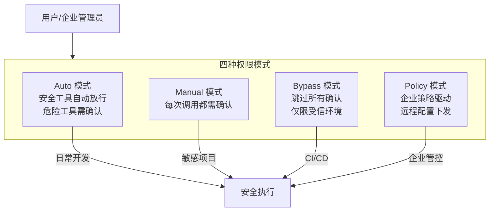
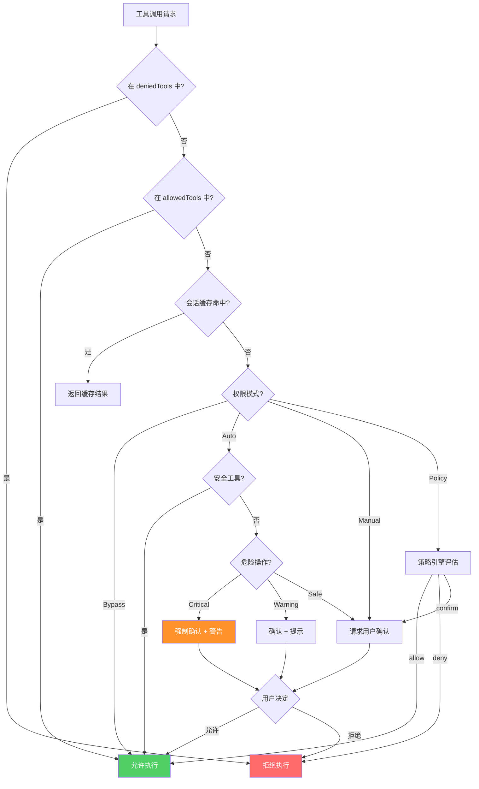

# 权限与安全机制：Claude Code 如何保护你的系统

当你让一个 AI 代理直接操作你的文件系统、执行 Shell 命令、甚至推送代码到远程仓库时，安全问题就不再是"锦上添花"，而是**底线**。Claude Code 从架构层面设计了一套多层次的权限控制系统，确保 AI 的每一步操作都在用户的可控范围内。

本文将完整拆解这套安全机制的设计与实现。

## 权限模型概述：四种模式

Claude Code 定义了四种权限模式，覆盖从个人开发到企业部署的全部场景：



这四种模式的核心类型定义如下：

```typescript
// src/permissions/types.ts
export type PermissionMode = "auto" | "manual" | "bypass" | "policy";

export interface PermissionConfig {
  mode: PermissionMode;
  allowedTools?: string[];
  deniedTools?: string[];
  policyUrl?: string;        // Policy 模式下的远程策略地址
  autoApprovePatterns?: string[]; // Auto 模式下额外放行的模式
}

export type PermissionResult =
  | { allowed: true }
  | { allowed: false; reason: string; requiresConfirmation: boolean };
```

## Auto 模式：智能安全分级

Auto 模式是大多数开发者的默认选择。它的核心思想是：**将工具按风险等级分类，低风险自动放行，高风险要求确认**。

```typescript
// src/permissions/toolClassification.ts
const SAFE_TOOLS: ReadonlySet<string> = new Set([
  "Read",
  "Glob",
  "Grep",
  "WebSearch",
  "WebFetch",
  "NotebookRead",
  "ToolSearch",
]);

const DANGEROUS_TOOLS: ReadonlySet<string> = new Set([
  "Bash",
  "Write",
  "Edit",
  "NotebookEdit",
]);

export function classifyTool(toolName: string): "safe" | "dangerous" | "unknown" {
  if (SAFE_TOOLS.has(toolName)) return "safe";
  if (DANGEROUS_TOOLS.has(toolName)) return "dangerous";
  // MCP 工具默认归为 unknown，需要额外判断
  return "unknown";
}
```

Auto 模式下的判断逻辑还会进一步检查工具参数。例如，`Bash` 工具虽然默认危险，但如果命令是 `git status` 或 `ls`，某些配置下可以自动放行：

```typescript
// src/permissions/autoMode.ts
function shouldAutoApproveCommand(command: string, config: PermissionConfig): boolean {
  const safeCommands = [
    /^git\s+(status|log|diff|branch|show)/,
    /^ls\b/,
    /^pwd$/,
    /^cat\s/,
    /^echo\s/,
  ];

  if (safeCommands.some(pattern => pattern.test(command.trim()))) {
    return true;
  }

  // 检查用户自定义的放行模式
  return (config.autoApprovePatterns ?? []).some(pattern =>
    new RegExp(pattern).test(command)
  );
}
```

## Manual 模式：逐一确认

Manual 模式的实现非常直接——每个工具调用都触发用户确认流程：

```typescript
// src/permissions/manualMode.ts
export async function checkManualPermission(
  toolName: string,
  toolInput: Record<string, unknown>,
  ui: PermissionUI
): Promise<PermissionResult> {
  const description = formatToolDescription(toolName, toolInput);

  const userChoice = await ui.requestConfirmation({
    title: `工具调用: ${toolName}`,
    description,
    options: ["Allow", "Allow for session", "Deny"],
  });

  switch (userChoice) {
    case "Allow":
      return { allowed: true };
    case "Allow for session":
      sessionAllowList.add(toolName);
      return { allowed: true };
    case "Deny":
      return { allowed: false, reason: "User denied", requiresConfirmation: false };
  }
}
```

Manual 模式适合处理敏感项目，或者你刚开始使用 Claude Code、想要充分了解它的行为模式时使用。

## Policy 模式：企业级策略控制

Policy 模式是面向企业部署的高级功能。它从远程端点拉取策略配置，实现集中化管控：

```typescript
// src/permissions/policyMode.ts
interface PolicyRule {
  tool: string;           // 工具名称或通配符
  action: "allow" | "deny" | "confirm";
  conditions?: {
    pathPrefix?: string;   // 限制文件路径前缀
    commandPattern?: string; // 限制命令模式
    timeWindow?: string;   // 时间窗口限制
  };
}

interface RemotePolicy {
  version: string;
  rules: PolicyRule[];
  refreshIntervalMs: number;
}

export class PolicyManager {
  private policy: RemotePolicy | null = null;
  private refreshTimer: NodeJS.Timeout | null = null;

  async initialize(policyUrl: string): Promise<void> {
    this.policy = await this.fetchPolicy(policyUrl);
    // 定期刷新策略
    this.refreshTimer = setInterval(
      () => this.fetchPolicy(policyUrl),
      this.policy.refreshIntervalMs
    );
  }

  evaluate(toolName: string, toolInput: Record<string, unknown>): PermissionResult {
    if (!this.policy) {
      return { allowed: false, reason: "Policy not loaded", requiresConfirmation: true };
    }

    for (const rule of this.policy.rules) {
      if (this.matchTool(rule.tool, toolName) && this.matchConditions(rule.conditions, toolInput)) {
        if (rule.action === "allow") return { allowed: true };
        if (rule.action === "deny") return { allowed: false, reason: `Policy denied: ${rule.tool}`, requiresConfirmation: false };
        return { allowed: false, reason: "Policy requires confirmation", requiresConfirmation: true };
      }
    }

    // 默认拒绝——安全优先
    return { allowed: false, reason: "No matching policy rule", requiresConfirmation: true };
  }

  private matchTool(pattern: string, toolName: string): boolean {
    if (pattern === "*") return true;
    if (pattern.endsWith("*")) return toolName.startsWith(pattern.slice(0, -1));
    return pattern === toolName;
  }
}
```

## 工具白名单：allowedTools 配置

用户可以通过 `settings.json` 或 `.claude/settings.json` 精确控制哪些工具可用：

```typescript
// settings.json 中的配置
{
  "permissions": {
    "allowedTools": [
      "Read",
      "Glob",
      "Grep",
      "Edit",
      "Bash(git *)",         // 仅允许 git 开头的命令
      "Bash(npm test)",      // 仅允许 npm test
      "mcp__github__*"       // 允许所有 GitHub MCP 工具
    ],
    "deniedTools": [
      "Bash(rm -rf *)",
      "Bash(git push --force*)"
    ]
  }
}
```

白名单支持两种匹配模式：

```typescript
// src/permissions/allowList.ts
export function matchAllowedTool(toolCall: ToolCall, patterns: string[]): boolean {
  for (const pattern of patterns) {
    // 精确匹配: "Read" 匹配 Read 工具
    if (pattern === toolCall.name) return true;

    // 参数模式匹配: "Bash(git *)" 匹配 Bash 工具中 git 开头的命令
    const paramMatch = pattern.match(/^(\w+)\((.+)\)$/);
    if (paramMatch) {
      const [, toolName, argPattern] = paramMatch;
      if (toolName !== toolCall.name) continue;
      const command = extractCommand(toolCall);
      if (command && minimatch(command, argPattern)) return true;
    }

    // 通配符匹配: "mcp__github__*" 匹配所有 GitHub MCP 工具
    if (pattern.endsWith("*") && toolCall.name.startsWith(pattern.slice(0, -1))) {
      return true;
    }
  }
  return false;
}
```

## 危险操作检测

Claude Code 内置了一套危险操作检测引擎，专门拦截可能造成不可逆后果的命令：

```typescript
// src/permissions/dangerDetection.ts
interface DangerPattern {
  pattern: RegExp;
  severity: "warning" | "critical";
  message: string;
}

const DANGER_PATTERNS: DangerPattern[] = [
  {
    pattern: /\bgit\s+push\s+.*--force\b/,
    severity: "critical",
    message: "强制推送可能覆盖远程提交历史",
  },
  {
    pattern: /\brm\s+(-rf?|--recursive)\s/,
    severity: "critical",
    message: "递归删除可能造成不可逆的数据丢失",
  },
  {
    pattern: /\bgit\s+reset\s+--hard\b/,
    severity: "warning",
    message: "硬重置将丢弃所有未提交的更改",
  },
  {
    pattern: /\bchmod\s+777\b/,
    severity: "warning",
    message: "设置 777 权限可能带来安全风险",
  },
  {
    pattern: />\s*\/etc\//,
    severity: "critical",
    message: "正在尝试写入系统配置文件",
  },
];

export function detectDangerousOperation(command: string): DangerPattern | null {
  for (const danger of DANGER_PATTERNS) {
    if (danger.pattern.test(command)) {
      return danger;
    }
  }
  return null;
}
```

## useCanUseTool Hook：权限检查的核心

所有权限检查的汇聚点是 `useCanUseTool` Hook。它串联了模式判断、白名单匹配、危险检测的全部逻辑：

```typescript
// src/hooks/useCanUseTool.ts
export function useCanUseTool() {
  const config = usePermissionConfig();
  const ui = usePermissionUI();
  const sessionCache = useRef(new Map<string, boolean>());

  const canUseTool = useCallback(
    async (toolName: string, toolInput: Record<string, unknown>): Promise<PermissionResult> => {
      // 1. 检查是否在 deniedTools 中
      if (matchDeniedTool({ name: toolName, input: toolInput }, config.deniedTools ?? [])) {
        return { allowed: false, reason: "Tool is denied by configuration", requiresConfirmation: false };
      }

      // 2. 检查是否在 allowedTools 白名单中（白名单优先放行）
      if (matchAllowedTool({ name: toolName, input: toolInput }, config.allowedTools ?? [])) {
        return { allowed: true };
      }

      // 3. 检查会话缓存
      const cacheKey = `${toolName}:${JSON.stringify(toolInput)}`;
      if (sessionCache.current.has(cacheKey)) {
        return { allowed: sessionCache.current.get(cacheKey)! };
      }

      // 4. 根据模式分发
      switch (config.mode) {
        case "bypass":
          return { allowed: true };

        case "auto":
          return checkAutoPermission(toolName, toolInput, config, ui);

        case "manual":
          return checkManualPermission(toolName, toolInput, ui);

        case "policy":
          return policyManager.evaluate(toolName, toolInput);
      }
    },
    [config, ui]
  );

  return { canUseTool };
}
```

完整的权限检查流程可以用下图表示：



## 安全设计原则

Claude Code 的权限系统遵循几个核心原则：

1. **默认安全（Secure by Default）**：未明确放行的操作一律需要确认，Policy 模式下无匹配规则则拒绝。
2. **最小权限（Least Privilege）**：工具白名单支持参数级精确控制，如 `Bash(git status)` 只放行特定命令。
3. **可审计（Auditable）**：所有权限决策都会记录日志，包括工具名、参数、决策结果和原因。
4. **分层防御（Defense in Depth）**：deniedTools 黑名单 -> allowedTools 白名单 -> 模式检查 -> 危险检测，多层过滤。

这套机制让 Claude Code 在提供强大自动化能力的同时，始终将控制权交还给用户和企业管理员。无论你是独立开发者还是大型团队，都能找到适合自己安全需求的配置方案。
