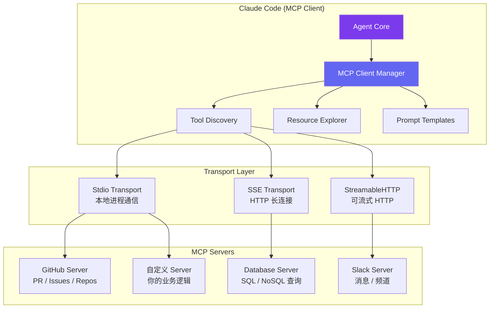
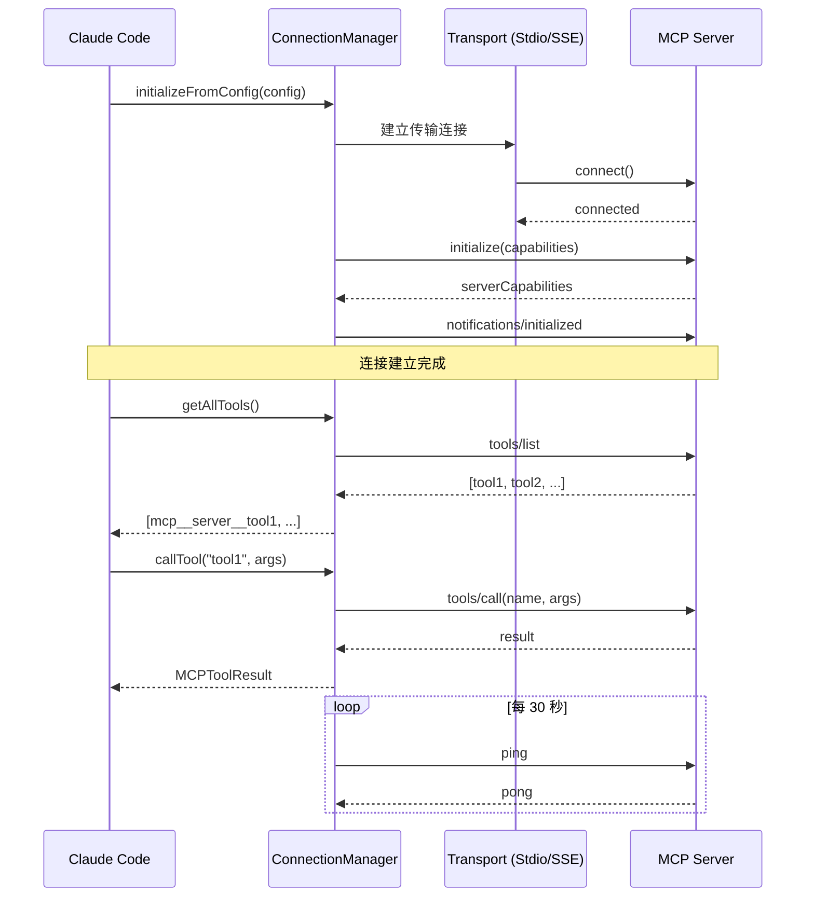

# MCP 协议集成：Claude Code 的扩展基石

Claude Code 之所以能够集成 GitHub、数据库、Slack 等外部服务，靠的不是为每个服务写一套硬编码的适配层，而是实现了一个统一的扩展协议——**MCP（Model Context Protocol）**。这是 Anthropic 提出的标准化协议，旨在让 AI 代理以一致的方式发现和调用外部工具。

本文将从协议设计到代码实现，完整拆解 Claude Code 中的 MCP 集成。

## MCP 协议简介

MCP 本质上是一个 **JSON-RPC 2.0** 之上的应用层协议。它定义了三类核心资源：

- **Tools**：可执行的工具函数（如"创建 PR"、"查询数据库"）
- **Resources**：可读取的数据资源（如文件内容、API 响应）
- **Prompts**：预定义的提示词模板（如"代码审查模板"）



## Client 实现：src/services/mcp/client.ts

Claude Code 的 MCP Client 负责与各个 MCP Server 建立连接、发送请求、处理响应。核心类的结构如下：

```typescript
// src/services/mcp/client.ts
import { JSONRPCClient } from "./jsonrpc";

export interface MCPClientOptions {
  serverName: string;
  transport: TransportConfig;
  timeout?: number;
  retryPolicy?: RetryPolicy;
}

export class MCPClient {
  private rpcClient: JSONRPCClient;
  private serverCapabilities: ServerCapabilities | null = null;
  private status: ConnectionStatus = "disconnected";

  constructor(private options: MCPClientOptions) {
    this.rpcClient = new JSONRPCClient(options.transport);
  }

  async connect(): Promise<void> {
    this.status = "connecting";

    try {
      // 建立传输层连接
      await this.rpcClient.connect();

      // MCP 握手：initialize 请求
      const initResult = await this.rpcClient.request("initialize", {
        protocolVersion: "2024-11-05",
        capabilities: {
          tools: { listChanged: true },
          resources: { subscribe: true },
          prompts: {},
        },
        clientInfo: {
          name: "claude-code",
          version: getVersion(),
        },
      });

      this.serverCapabilities = initResult.capabilities;

      // 发送 initialized 通知，完成握手
      await this.rpcClient.notify("notifications/initialized", {});
      this.status = "connected";
    } catch (error) {
      this.status = "error";
      throw new MCPConnectionError(this.options.serverName, error);
    }
  }

  // 发现服务端提供的工具列表
  async listTools(): Promise<MCPTool[]> {
    const result = await this.rpcClient.request("tools/list", {});
    return result.tools.map((tool: RawMCPTool) => ({
      name: `mcp__${this.options.serverName}__${tool.name}`,
      description: tool.description,
      inputSchema: tool.inputSchema,
      serverName: this.options.serverName,
      originalName: tool.name,
    }));
  }

  // 调用工具
  async callTool(toolName: string, args: Record<string, unknown>): Promise<MCPToolResult> {
    const result = await this.rpcClient.request("tools/call", {
      name: toolName,
      arguments: args,
    });
    return {
      content: result.content,
      isError: result.isError ?? false,
    };
  }

  // 读取资源
  async readResource(uri: string): Promise<MCPResource> {
    const result = await this.rpcClient.request("resources/read", { uri });
    return result.contents[0];
  }
}
```

注意工具名称的命名规则：Claude Code 将 MCP 工具名映射为 `mcp__{serverName}__{toolName}` 的格式，这样在 Agent 的工具列表中可以清晰区分来源。

## 连接管理：MCPConnectionManager

在实际使用中，用户可能配置了多个 MCP Server，需要统一管理它们的生命周期：

```typescript
// src/services/mcp/connectionManager.ts
export class MCPConnectionManager {
  private clients: Map<string, MCPClient> = new Map();
  private healthCheckInterval: NodeJS.Timeout | null = null;

  async initializeFromConfig(config: MCPConfig): Promise<void> {
    const connectionTasks = Object.entries(config.servers).map(
      async ([name, serverConfig]) => {
        const client = new MCPClient({
          serverName: name,
          transport: serverConfig.transport,
          timeout: serverConfig.timeout ?? 30000,
          retryPolicy: {
            maxRetries: 3,
            baseDelayMs: 1000,
            maxDelayMs: 30000,
          },
        });

        try {
          await client.connect();
          this.clients.set(name, client);
          console.log(`MCP Server "${name}" connected`);
        } catch (error) {
          console.error(`MCP Server "${name}" failed to connect:`, error);
          // 连接失败不阻塞其他 Server
        }
      }
    );

    await Promise.allSettled(connectionTasks);
    this.startHealthCheck();
  }

  private startHealthCheck(): void {
    this.healthCheckInterval = setInterval(async () => {
      for (const [name, client] of this.clients) {
        try {
          await client.ping();
        } catch {
          console.warn(`MCP Server "${name}" health check failed, reconnecting...`);
          await this.reconnect(name);
        }
      }
    }, 30000); // 每 30 秒检查一次
  }

  private async reconnect(name: string): Promise<void> {
    const client = this.clients.get(name);
    if (!client) return;

    for (let attempt = 1; attempt <= 3; attempt++) {
      try {
        await client.connect();
        console.log(`MCP Server "${name}" reconnected (attempt ${attempt})`);
        return;
      } catch {
        const delay = Math.min(1000 * Math.pow(2, attempt), 30000);
        await sleep(delay);
      }
    }
    console.error(`MCP Server "${name}" reconnection failed after 3 attempts`);
  }

  // 汇总所有 Server 的工具列表
  async getAllTools(): Promise<MCPTool[]> {
    const toolLists = await Promise.all(
      Array.from(this.clients.values()).map(client => client.listTools())
    );
    return toolLists.flat();
  }
}
```

这里有几个关键设计决策：

1. **并行连接**：多个 Server 同时初始化，互不阻塞
2. **优雅降级**：单个 Server 失败不影响整体
3. **自动重连**：指数退避策略，最多重试 3 次
4. **健康检查**：定期 ping 检测，确保连接可用

## 资源解析

MCP 的三类资源在 Claude Code 中有不同的消费方式：

```typescript
// src/services/mcp/resources.ts

// Tools: 注册到 Agent 的工具列表中
export async function registerMCPTools(
  manager: MCPConnectionManager,
  toolRegistry: ToolRegistry
): Promise<void> {
  const tools = await manager.getAllTools();

  for (const tool of tools) {
    toolRegistry.register({
      name: tool.name,
      description: tool.description,
      inputSchema: tool.inputSchema,
      execute: async (args: Record<string, unknown>) => {
        const client = manager.getClient(tool.serverName);
        return client.callTool(tool.originalName, args);
      },
    });
  }
}

// Resources: 作为上下文注入到对话中
export async function fetchMCPResources(
  manager: MCPConnectionManager,
  resourceUris: string[]
): Promise<ContextEntry[]> {
  return Promise.all(
    resourceUris.map(async uri => {
      const [serverName] = parseResourceUri(uri);
      const client = manager.getClient(serverName);
      const resource = await client.readResource(uri);
      return {
        type: "mcp_resource" as const,
        content: resource.text ?? Buffer.from(resource.blob!, "base64").toString(),
        mimeType: resource.mimeType,
        uri,
      };
    })
  );
}

// Prompts: 作为可选的提示词模板
export async function listMCPPrompts(
  manager: MCPConnectionManager
): Promise<MCPPrompt[]> {
  const promptLists = await Promise.all(
    Array.from(manager.getClients()).map(async ([name, client]) => {
      const result = await client.listPrompts();
      return result.map(p => ({ ...p, serverName: name }));
    })
  );
  return promptLists.flat();
}
```

## OAuth 认证流程

部分 MCP Server（特别是通过 SSE/StreamableHTTP 连接的远程 Server）需要 OAuth 认证：

```typescript
// src/services/mcp/auth.ts
export class MCPOAuthHandler {
  private tokenStore: TokenStore;

  constructor(private serverConfig: MCPServerConfig) {
    this.tokenStore = new FileTokenStore(
      path.join(getConfigDir(), "mcp-tokens", serverConfig.name)
    );
  }

  async getAuthenticatedTransport(): Promise<TransportConfig> {
    let token = await this.tokenStore.getToken();

    if (!token || this.isExpired(token)) {
      token = await this.performOAuthFlow();
      await this.tokenStore.saveToken(token);
    }

    return {
      ...this.serverConfig.transport,
      headers: {
        Authorization: `Bearer ${token.accessToken}`,
      },
    };
  }

  private async performOAuthFlow(): Promise<OAuthToken> {
    // 1. 从 MCP Server 获取 OAuth 元数据
    const metadata = await fetch(
      `${this.serverConfig.url}/.well-known/oauth-authorization-server`
    ).then(r => r.json());

    // 2. 启动本地回调服务器
    const callbackServer = await startLocalCallbackServer(8912);

    // 3. 打开浏览器进行授权
    const authUrl = new URL(metadata.authorization_endpoint);
    authUrl.searchParams.set("client_id", "claude-code");
    authUrl.searchParams.set("redirect_uri", `http://localhost:8912/callback`);
    authUrl.searchParams.set("response_type", "code");
    authUrl.searchParams.set("scope", this.serverConfig.scopes?.join(" ") ?? "");

    await openBrowser(authUrl.toString());

    // 4. 等待回调获取授权码
    const code = await callbackServer.waitForCode();

    // 5. 用授权码换取 token
    const tokenResponse = await fetch(metadata.token_endpoint, {
      method: "POST",
      headers: { "Content-Type": "application/x-www-form-urlencoded" },
      body: new URLSearchParams({
        grant_type: "authorization_code",
        code,
        client_id: "claude-code",
        redirect_uri: `http://localhost:8912/callback`,
      }),
    });

    return tokenResponse.json();
  }
}
```

## 配置格式：.claude/mcp.json

用户通过 `.claude/mcp.json` 声明要连接的 MCP Server：

```typescript
// .claude/mcp.json 示例
{
  "mcpServers": {
    "github": {
      "command": "npx",
      "args": ["-y", "@anthropic/mcp-server-github"],
      "env": {
        "GITHUB_TOKEN": "ghp_xxxxxxxxxxxx"
      },
      "transport": "stdio"
    },
    "database": {
      "url": "https://mcp.example.com/db",
      "transport": "sse",
      "auth": {
        "type": "oauth",
        "scopes": ["read", "write"]
      }
    },
    "custom-tools": {
      "command": "node",
      "args": ["./my-mcp-server/index.js"],
      "transport": "stdio",
      "timeout": 60000
    }
  }
}
```

配置加载的优先级为：项目级 `.claude/mcp.json` > 用户级 `~/.claude/mcp.json`，两者会合并而非覆盖。



## 总结

MCP 协议为 Claude Code 提供了一个优雅的扩展架构。通过标准化的工具发现、调用和资源访问接口，任何开发者都可以编写一个 MCP Server 来扩展 Claude Code 的能力——无需修改 Claude Code 本身的代码。

这种**协议驱动**的扩展模式，远比传统的插件 API 更加灵活和松耦合。MCP Server 可以用任何语言编写，通过 Stdio 或 HTTP 与 Claude Code 通信，真正实现了"一次编写，处处可用"的扩展体验。
