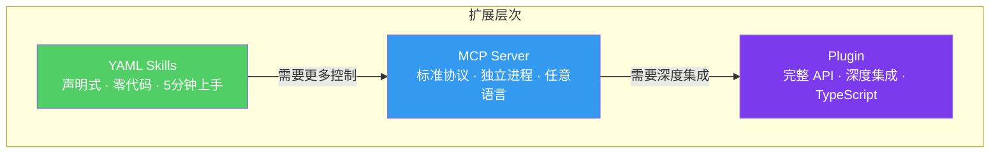

# Skills 与 Plugin 系统：构建你自己的扩展

如果说 MCP 协议是 Claude Code 对外连接的"高速公路"，那么 Skills 和 Plugin 系统就是它的"内部齿轮组"。Skills 让你用简单的声明式定义为 Claude Code 添加新能力，Plugin 系统则提供了更底层的扩展接口。

本文将从源码层面剖析这两套系统的设计与实现，并给出自定义扩展的开发指南。

## Skills 系统架构

Skills 系统的代码组织在 `src/skills/` 目录下，结构清晰：

```
src/skills/
├── types.ts              # Skill 类型定义
├── bundledSkills.ts       # 内置 Skill 注册
├── loadSkillsDir.ts       # 从目录加载自定义 Skill
├── skillRegistry.ts       # Skill 注册表
├── mcpSkillBuilder.ts     # 从 MCP 构建 Skill
└── skills/
    ├── verify.ts          # 验证代码变更
    ├── simplify.ts        # 简化代码
    ├── updateConfig.ts    # 更新配置
    ├── loop.ts            # 循环执行
    ├── remember.ts        # 记忆管理
    ├── debug.ts           # 调试辅助
    ├── batch.ts           # 批量操作
    └── keybindings.ts     # 快捷键管理
```

### Skill 定义格式

每个 Skill 的类型定义非常精简，但表达力很强：

```typescript
// src/skills/types.ts
export interface SkillDefinition {
  /** 技能唯一标识 */
  name: string;

  /** 显示名称 */
  displayName?: string;

  /** 技能描述，用于 AI 判断何时触发 */
  description: string;

  /** 触发条件：何时自动建议使用该技能 */
  trigger?: SkillTrigger;

  /** 技能执行时注入的 prompt */
  prompt: string | ((args?: string) => string);

  /** 技能需要的工具列表 */
  tools?: string[];

  /** 技能可接受的参数格式 */
  args?: {
    name: string;
    description: string;
    required?: boolean;
  }[];

  /** 来源标识 */
  source?: "bundled" | "directory" | "mcp" | "plugin";
}

export interface SkillTrigger {
  /** 用户输入匹配模式 */
  pattern?: RegExp;

  /** 当特定条件满足时触发 */
  when?: (context: SkillContext) => boolean;

  /** 是否仅在被显式调用时触发 */
  explicitOnly?: boolean;
}

export interface SkillContext {
  userMessage: string;
  recentFiles: string[];
  gitStatus: string;
  currentDirectory: string;
}
```

### 内置 Skills 详解

Claude Code 内置了 8 个核心 Skill，每个都有明确的职责：

```typescript
// src/skills/bundledSkills.ts
import { SkillDefinition } from "./types";

export const bundledSkills: SkillDefinition[] = [
  {
    name: "verify",
    displayName: "验证变更",
    description: "Review changed code for correctness, run tests and linters",
    trigger: {
      when: (ctx) => /verify|check|validate|确认|验证/.test(ctx.userMessage),
    },
    prompt: `Review all recently changed code for correctness. Run relevant tests 
and linters. Report any issues found and fix them if possible.`,
    tools: ["Bash", "Read", "Glob", "Grep"],
  },
  {
    name: "simplify",
    displayName: "简化代码",
    description: "Review changed code for reuse, quality, and efficiency, then fix issues",
    trigger: {
      when: (ctx) => /simplify|refactor|简化|重构/.test(ctx.userMessage),
    },
    prompt: (args?: string) => {
      const target = args || "recently changed files";
      return `Analyze ${target} for opportunities to simplify, remove duplication, 
and improve code quality. Make the improvements directly.`;
    },
    tools: ["Read", "Edit", "Glob", "Grep", "Bash"],
  },
  {
    name: "loop",
    displayName: "循环执行",
    description: "Run a prompt or command on a recurring interval",
    trigger: { explicitOnly: true },
    prompt: (args?: string) => {
      const [interval, ...commandParts] = (args || "10m").split(" ");
      const command = commandParts.join(" ") || "check status";
      return `Run the following on a ${interval} interval: ${command}`;
    },
    args: [
      { name: "interval", description: "执行间隔 (如 5m, 1h)", required: false },
      { name: "command", description: "要执行的命令或提示", required: false },
    ],
    tools: ["Bash", "Read"],
  },
  {
    name: "remember",
    displayName: "记忆管理",
    description: "Save important context to CLAUDE.md for future sessions",
    trigger: {
      when: (ctx) => /remember|记住|save.*context|保存/.test(ctx.userMessage),
    },
    prompt: `Review the current conversation and identify key decisions, preferences, 
or project-specific knowledge that should be remembered across sessions. 
Save them to the appropriate CLAUDE.md file.`,
    tools: ["Read", "Edit", "Write"],
  },
  {
    name: "debug",
    displayName: "调试辅助",
    description: "Help debug an issue by analyzing logs, errors, and code",
    trigger: {
      when: (ctx) => /debug|调试|error|错误|bug|issue/.test(ctx.userMessage),
    },
    prompt: (args?: string) => {
      const issue = args || "the current issue";
      return `Debug ${issue}. Analyze error messages, trace through the code, 
check logs, and identify the root cause. Suggest or implement a fix.`;
    },
    tools: ["Bash", "Read", "Glob", "Grep", "Edit"],
  },
  {
    name: "batch",
    displayName: "批量操作",
    description: "Apply a change across multiple files matching a pattern",
    trigger: { explicitOnly: true },
    prompt: (args?: string) => `Apply the following batch operation: ${args || "describe the operation"}`,
    args: [
      { name: "pattern", description: "文件匹配模式", required: true },
      { name: "operation", description: "要执行的操作", required: true },
    ],
    tools: ["Glob", "Read", "Edit", "Bash"],
  },
  {
    name: "updateConfig",
    displayName: "更新配置",
    description: "Configure Claude Code settings via settings.json",
    trigger: {
      when: (ctx) => /config|settings|配置|设置/.test(ctx.userMessage),
    },
    prompt: `Help the user update their Claude Code configuration. 
Show current settings and guide them through changes.`,
    tools: ["Read", "Edit"],
  },
  {
    name: "keybindings",
    displayName: "快捷键管理",
    description: "Customize keyboard shortcuts and keybindings",
    trigger: {
      when: (ctx) => /keybinding|shortcut|快捷键|按键/.test(ctx.userMessage),
    },
    prompt: `Help customize keyboard shortcuts in ~/.claude/keybindings.json.`,
    tools: ["Read", "Edit"],
  },
];
```

## Skill 加载机制

### 从目录加载：loadSkillsDir.ts

除了内置 Skill，用户可以在项目目录或全局目录中放置自定义 Skill 定义文件：

```typescript
// src/skills/loadSkillsDir.ts
import * as fs from "fs/promises";
import * as path from "path";
import * as yaml from "yaml";
import { SkillDefinition } from "./types";

const SKILL_FILE_EXTENSIONS = [".yaml", ".yml", ".json"];

export async function loadSkillsFromDirectory(
  dirPath: string
): Promise<SkillDefinition[]> {
  const skills: SkillDefinition[] = [];

  try {
    const entries = await fs.readdir(dirPath, { withFileTypes: true });

    for (const entry of entries) {
      if (!entry.isFile()) continue;

      const ext = path.extname(entry.name);
      if (!SKILL_FILE_EXTENSIONS.includes(ext)) continue;

      try {
        const filePath = path.join(dirPath, entry.name);
        const content = await fs.readFile(filePath, "utf-8");
        const parsed = ext === ".json" ? JSON.parse(content) : yaml.parse(content);

        const skill = validateSkillDefinition(parsed);
        if (skill) {
          skill.source = "directory";
          skills.push(skill);
        }
      } catch (error) {
        console.warn(`Failed to load skill from ${entry.name}:`, error);
      }
    }
  } catch {
    // 目录不存在则静默忽略
  }

  return skills;
}

function validateSkillDefinition(raw: unknown): SkillDefinition | null {
  if (!raw || typeof raw !== "object") return null;

  const obj = raw as Record<string, unknown>;

  if (typeof obj.name !== "string" || typeof obj.prompt !== "string") {
    return null;
  }

  return {
    name: obj.name,
    displayName: obj.displayName as string | undefined,
    description: (obj.description as string) || "",
    prompt: obj.prompt as string,
    tools: Array.isArray(obj.tools) ? obj.tools : undefined,
    source: "directory",
  };
}
```

自定义 Skill 文件的格式：

```yaml
# .claude/skills/my-deploy.yaml
name: deploy
displayName: 一键部署
description: Build and deploy the application to staging
prompt: |
  Run the full deployment pipeline:
  1. Run tests with `npm test`
  2. Build the project with `npm run build`
  3. Deploy to staging with `npm run deploy:staging`
  4. Verify the deployment by checking the health endpoint
  Report the result of each step.
tools:
  - Bash
  - Read
```

### Skill 注册表

所有来源的 Skill 在注册表中统一管理：

```typescript
// src/skills/skillRegistry.ts
export class SkillRegistry {
  private skills: Map<string, SkillDefinition> = new Map();

  async initialize(): Promise<void> {
    // 1. 注册内置 Skills
    for (const skill of bundledSkills) {
      this.register(skill);
    }

    // 2. 从项目目录加载
    const projectSkills = await loadSkillsFromDirectory(
      path.join(process.cwd(), ".claude", "skills")
    );
    for (const skill of projectSkills) {
      this.register(skill);
    }

    // 3. 从用户全局目录加载
    const globalSkills = await loadSkillsFromDirectory(
      path.join(getConfigDir(), "skills")
    );
    for (const skill of globalSkills) {
      this.register(skill);
    }

    // 4. 从 MCP Server 构建 Skills
    const mcpSkills = await buildMCPSkills();
    for (const skill of mcpSkills) {
      this.register(skill);
    }
  }

  register(skill: SkillDefinition): void {
    if (this.skills.has(skill.name)) {
      console.warn(`Skill "${skill.name}" already registered, overwriting`);
    }
    this.skills.set(skill.name, skill);
  }

  findByName(name: string): SkillDefinition | undefined {
    return this.skills.get(name);
  }

  findMatching(context: SkillContext): SkillDefinition[] {
    return Array.from(this.skills.values()).filter(skill => {
      if (!skill.trigger) return false;
      if (skill.trigger.explicitOnly) return false;
      if (skill.trigger.pattern && skill.trigger.pattern.test(context.userMessage)) return true;
      if (skill.trigger.when && skill.trigger.when(context)) return true;
      return false;
    });
  }

  listAll(): SkillDefinition[] {
    return Array.from(this.skills.values());
  }
}
```

## MCP Skill Builder

一个巧妙的设计是，Claude Code 可以从已连接的 MCP Server 自动生成 Skill：

```typescript
// src/skills/mcpSkillBuilder.ts
export async function buildMCPSkills(): Promise<SkillDefinition[]> {
  const manager = getMCPConnectionManager();
  if (!manager) return [];

  const skills: SkillDefinition[] = [];

  // 从 MCP Prompts 构建 Skills
  for (const [serverName, client] of manager.getClients()) {
    try {
      const prompts = await client.listPrompts();

      for (const prompt of prompts) {
        skills.push({
          name: `mcp__${serverName}__${prompt.name}`,
          displayName: prompt.name,
          description: prompt.description || `MCP prompt from ${serverName}`,
          prompt: async (args?: string) => {
            const result = await client.getPrompt(prompt.name, parseArgs(args));
            return result.messages
              .map((m: { content: { text: string } }) => m.content.text)
              .join("\n");
          },
          source: "mcp",
        });
      }
    } catch {
      // Server 不支持 prompts 则跳过
    }
  }

  return skills;
}
```

这意味着任何 MCP Server 暴露的 Prompts 都会自动成为 Claude Code 中可用的 Skill。

## Plugin 系统

Plugin 系统提供了比 Skill 更底层的扩展能力：

```typescript
// src/services/plugins/types.ts
export interface PluginDefinition {
  name: string;
  version: string;
  description?: string;

  /** 插件初始化 */
  activate: (context: PluginContext) => Promise<void>;

  /** 插件卸载 */
  deactivate?: () => Promise<void>;
}

export interface PluginContext {
  /** 注册自定义工具 */
  registerTool: (tool: ToolDefinition) => void;

  /** 注册 Skill */
  registerSkill: (skill: SkillDefinition) => void;

  /** 注册钩子 */
  registerHook: (hook: HookDefinition) => void;

  /** 访问配置 */
  getConfig: () => Record<string, unknown>;

  /** 日志 */
  logger: PluginLogger;
}
```

插件的发现与加载：

```typescript
// src/services/plugins/loader.ts
export class PluginLoader {
  private plugins: Map<string, PluginDefinition> = new Map();

  async loadFromDirectory(dir: string): Promise<void> {
    const entries = await fs.readdir(dir, { withFileTypes: true });

    for (const entry of entries) {
      if (!entry.isDirectory()) continue;

      const pkgPath = path.join(dir, entry.name, "package.json");
      try {
        const pkg = JSON.parse(await fs.readFile(pkgPath, "utf-8"));

        if (!pkg.claudeCodePlugin) continue;

        const mainPath = path.join(dir, entry.name, pkg.main || "index.js");
        const pluginModule = await import(mainPath);
        const plugin: PluginDefinition = pluginModule.default || pluginModule;

        this.plugins.set(plugin.name, plugin);
      } catch {
        // 无效插件目录，跳过
      }
    }
  }

  async activateAll(context: PluginContext): Promise<void> {
    for (const [name, plugin] of this.plugins) {
      try {
        await plugin.activate(context);
        console.log(`Plugin "${name}" activated`);
      } catch (error) {
        console.error(`Plugin "${name}" activation failed:`, error);
      }
    }
  }
}
```

## 自定义扩展开发指南

开发自己的 Claude Code 扩展有三种方式，按复杂度递增：

### 方式一：YAML Skill（最简单）

在项目根目录创建 `.claude/skills/` 目录，添加 YAML 文件：

```yaml
# .claude/skills/code-review.yaml
name: code-review
displayName: 代码审查
description: Perform a thorough code review on recent changes
prompt: |
  Perform a comprehensive code review:
  1. Check git diff for recent changes
  2. Review code quality, naming, structure
  3. Look for potential bugs and edge cases
  4. Check test coverage
  5. Provide a summary with actionable feedback
tools:
  - Bash
  - Read
  - Glob
  - Grep
```

### 方式二：MCP Server（中等复杂度）

编写一个 MCP Server 暴露自定义工具：

```typescript
// my-mcp-server/index.ts
import { Server } from "@modelcontextprotocol/sdk/server/index.js";
import { StdioServerTransport } from "@modelcontextprotocol/sdk/server/stdio.js";

const server = new Server({
  name: "my-tools",
  version: "1.0.0",
}, {
  capabilities: { tools: {} },
});

server.setRequestHandler("tools/list", async () => ({
  tools: [
    {
      name: "query_metrics",
      description: "Query application metrics from monitoring system",
      inputSchema: {
        type: "object",
        properties: {
          metric: { type: "string", description: "Metric name" },
          timeRange: { type: "string", description: "Time range (e.g. 1h, 24h)" },
        },
        required: ["metric"],
      },
    },
  ],
}));

server.setRequestHandler("tools/call", async (request) => {
  if (request.params.name === "query_metrics") {
    const { metric, timeRange } = request.params.arguments as any;
    const data = await fetchMetrics(metric, timeRange || "1h");
    return { content: [{ type: "text", text: JSON.stringify(data) }] };
  }
  throw new Error(`Unknown tool: ${request.params.name}`);
});

const transport = new StdioServerTransport();
await server.connect(transport);
```

然后在 `.claude/mcp.json` 中配置：

```json
{
  "mcpServers": {
    "my-tools": {
      "command": "npx",
      "args": ["tsx", "./my-mcp-server/index.ts"],
      "transport": "stdio"
    }
  }
}
```

### 方式三：Plugin（最灵活）

创建一个完整的 Plugin 包：

```typescript
// my-plugin/index.ts
import { PluginDefinition, PluginContext } from "claude-code/plugins";

const plugin: PluginDefinition = {
  name: "my-plugin",
  version: "1.0.0",
  description: "Custom plugin with tools and hooks",

  async activate(context: PluginContext) {
    // 注册自定义工具
    context.registerTool({
      name: "analyze_bundle",
      description: "Analyze webpack bundle size",
      inputSchema: {
        type: "object",
        properties: {
          entryPoint: { type: "string" },
        },
      },
      execute: async (args) => {
        // 实现逻辑
        return { result: "Bundle analysis complete" };
      },
    });

    // 注册 Skill
    context.registerSkill({
      name: "optimize-bundle",
      description: "Analyze and optimize bundle size",
      prompt: "Analyze the webpack bundle and suggest optimizations",
      tools: ["analyze_bundle", "Read", "Edit"],
    });

    context.logger.info("My plugin activated!");
  },

  async deactivate() {
    // 清理资源
  },
};

export default plugin;
```

## 总结

Claude Code 的扩展体系呈现三层结构：



从最简单的 YAML Skill 到完整的 Plugin，开发者可以根据自己的需求选择合适的扩展层级。这套设计让 Claude Code 既保持了核心的简洁性，又具备了几乎无限的可扩展性。
