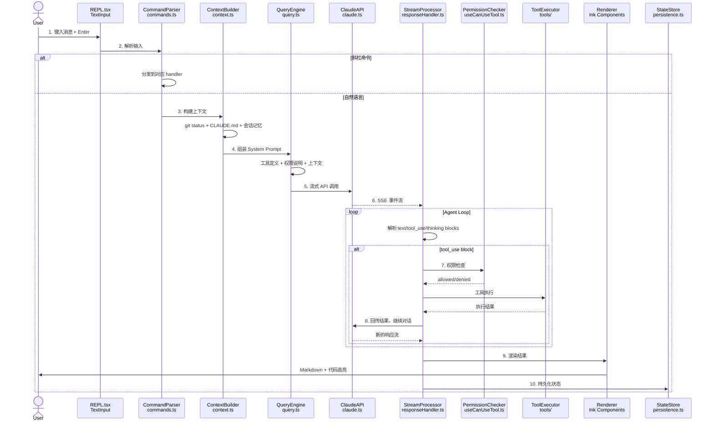

# 一次完整的 Claude Code 请求流程

当你在 Claude Code 中输入一句话然后按下回车，背后发生了什么？这个看似简单的交互，实际上经历了从输入捕获、命令解析、上下文构建、API 调用、工具执行到结果渲染的 **10 个关键步骤**。

本文将以一次真实的请求为例，完整追踪每一步的代码实现。这是本系列最重要的一篇文章——理解了这条链路，你就理解了 Claude Code 的运行本质。

## 全链路概览

先看完整的序列图，建立全局视角：



接下来逐步拆解。

## Step 1：用户输入 — REPL.tsx TextInput

一切从 REPL 组件的文本输入开始：

```typescript
// src/components/REPL.tsx
import { Box, Text } from "ink";
import TextInput from "ink-text-input";

export function REPL() {
  const [input, setInput] = useState("");
  const [isProcessing, setIsProcessing] = useState(false);
  const { messages, addMessage } = useConversation();
  const queryEngine = useQueryEngine();

  const handleSubmit = useCallback(async (value: string) => {
    const trimmed = value.trim();
    if (!trimmed || isProcessing) return;

    setInput("");
    setIsProcessing(true);

    // 添加用户消息到对话历史
    addMessage({ role: "user", content: trimmed });

    try {
      await processInput(trimmed, queryEngine, addMessage);
    } finally {
      setIsProcessing(false);
    }
  }, [isProcessing, queryEngine, addMessage]);

  // 快捷键处理
  useInput((input, key) => {
    if (key.escape) {
      // Escape: 取消当前操作
      queryEngine.abort();
    }
    if (key.ctrl && input === "c") {
      // Ctrl+C: 中断
      queryEngine.abort();
    }
  });

  return (
    <Box flexDirection="column">
      <MessageList messages={messages} />
      <Box>
        <Text color="cyan">{"❯ "}</Text>
        <TextInput
          value={input}
          onChange={setInput}
          onSubmit={handleSubmit}
          placeholder={isProcessing ? "Processing..." : "Ask anything..."}
        />
      </Box>
    </Box>
  );
}
```

REPL 组件基于 Ink（React for CLI）实现，`TextInput` 负责捕获用户输入，`handleSubmit` 是整个链路的入口。

## Step 2：命令解析 — 斜杠命令 vs 自然语言

输入首先进入命令解析器，判断是斜杠命令还是自然语言：

```typescript
// src/commands/parser.ts
export async function processInput(
  input: string,
  queryEngine: QueryEngine,
  addMessage: (msg: Message) => void
): Promise<void> {
  // 斜杠命令检测
  if (input.startsWith("/")) {
    const [commandName, ...args] = input.slice(1).split(/\s+/);
    const command = commandRegistry.get(commandName);

    if (command) {
      await command.handler(args.join(" "), { queryEngine, addMessage });
      return;
    }

    // 未知命令，检查是否是 Skill
    const skill = skillRegistry.findByName(commandName);
    if (skill) {
      const prompt = typeof skill.prompt === "function"
        ? skill.prompt(args.join(" "))
        : skill.prompt;
      await queryEngine.execute(prompt, { tools: skill.tools });
      return;
    }

    // 真的找不到，提示用户
    addMessage({
      role: "system",
      content: `Unknown command: /${commandName}. Type /help for available commands.`,
    });
    return;
  }

  // 自然语言输入，进入 QueryEngine
  await queryEngine.execute(input);
}
```

斜杠命令的注册表：

```typescript
// src/commands/registry.ts
export interface CommandDefinition {
  name: string;
  aliases?: string[];
  description: string;
  handler: (args: string, context: CommandContext) => Promise<void>;
}

export const commandRegistry = new Map<string, CommandDefinition>();

// 注册内置命令
commandRegistry.set("help", {
  name: "help",
  description: "Show available commands",
  handler: async (_, { addMessage }) => {
    const commands = Array.from(commandRegistry.values());
    const helpText = commands
      .map(c => `  /${c.name} - ${c.description}`)
      .join("\n");
    addMessage({ role: "system", content: helpText });
  },
});

commandRegistry.set("clear", {
  name: "clear",
  description: "Clear conversation history",
  handler: async (_, { queryEngine }) => {
    queryEngine.clearHistory();
  },
});

commandRegistry.set("compact", {
  name: "compact",
  description: "Summarize and compact conversation history",
  handler: async (_, { queryEngine }) => {
    await queryEngine.compactHistory();
  },
});
```

## Step 3：上下文构建 — context.ts

自然语言请求进入 QueryEngine 后，第一步是构建上下文——收集当前环境的所有相关信息：

```typescript
// src/context/builder.ts
export interface ConversationContext {
  gitStatus: string | null;
  gitBranch: string | null;
  claudeMd: string | null;
  workingDirectory: string;
  sessionMemory: MemoryEntry[];
  recentFiles: string[];
  activeFile: string | null;
}

export async function buildContext(): Promise<ConversationContext> {
  // 并行获取多个上下文源
  const [gitStatus, gitBranch, claudeMd, sessionMemory] = await Promise.allSettled([
    execCapture("git status --short"),
    execCapture("git branch --show-current"),
    loadClaudeMd(),
    loadSessionMemory(),
  ]);

  return {
    gitStatus: gitStatus.status === "fulfilled" ? gitStatus.value : null,
    gitBranch: gitBranch.status === "fulfilled" ? gitBranch.value?.trim() : null,
    claudeMd: claudeMd.status === "fulfilled" ? claudeMd.value : null,
    workingDirectory: process.cwd(),
    sessionMemory: sessionMemory.status === "fulfilled" ? sessionMemory.value : [],
    recentFiles: getRecentlyAccessedFiles(),
    activeFile: getActiveFile(),
  };
}

// CLAUDE.md 的加载有优先级链
async function loadClaudeMd(): Promise<string | null> {
  const locations = [
    path.join(process.cwd(), "CLAUDE.md"),        // 项目根目录
    path.join(process.cwd(), ".claude", "CLAUDE.md"), // .claude 目录
    path.join(getHomeDir(), ".claude", "CLAUDE.md"),  // 用户全局
  ];

  const contents: string[] = [];
  for (const loc of locations) {
    try {
      const content = await fs.readFile(loc, "utf-8");
      contents.push(`<!-- From: ${loc} -->\n${content}`);
    } catch {
      // 文件不存在，跳过
    }
  }

  return contents.length > 0 ? contents.join("\n\n---\n\n") : null;
}
```

`Promise.allSettled` 而非 `Promise.all` 是一个关键设计——任何一个上下文源的失败不应阻塞整个流程。比如在非 Git 仓库中，`git status` 会失败，但不影响其他上下文的收集。

## Step 4：System Prompt 组装 — query.ts

上下文收集完毕后，QueryEngine 将其组装成完整的 System Prompt：

```typescript
// src/query/engine.ts
export class QueryEngine {
  private conversationHistory: Message[] = [];
  private toolRegistry: ToolRegistry;
  private permissionConfig: PermissionConfig;

  async execute(userMessage: string, options?: ExecuteOptions): Promise<void> {
    // 构建上下文
    const context = await buildContext();

    // 组装 System Prompt
    const systemPrompt = this.buildSystemPrompt(context, options);

    // 添加用户消息
    this.conversationHistory.push({
      role: "user",
      content: userMessage,
    });

    // 进入 Agent Loop
    await this.agentLoop(systemPrompt);
  }

  private buildSystemPrompt(
    context: ConversationContext,
    options?: ExecuteOptions
  ): string {
    const parts: string[] = [];

    // 1. 核心身份与能力说明
    parts.push(CORE_IDENTITY_PROMPT);

    // 2. 工具定义
    const tools = options?.tools
      ? this.toolRegistry.getByNames(options.tools)
      : this.toolRegistry.getAll();
    parts.push(this.formatToolDefinitions(tools));

    // 3. 权限说明
    parts.push(this.formatPermissionGuidelines());

    // 4. 环境信息
    parts.push(`## Environment
- Working directory: ${context.workingDirectory}
- Git branch: ${context.gitBranch || "N/A"}
- Git status:\n${context.gitStatus || "Not a git repository"}
- Date: ${new Date().toISOString()}`);

    // 5. CLAUDE.md 内容
    if (context.claudeMd) {
      parts.push(`## Project Instructions (CLAUDE.md)\n${context.claudeMd}`);
    }

    // 6. 会话记忆
    if (context.sessionMemory.length > 0) {
      const memoryText = context.sessionMemory
        .map(m => `- ${m.key}: ${m.value}`)
        .join("\n");
      parts.push(`## Session Memory\n${memoryText}`);
    }

    return parts.join("\n\n");
  }

  private formatToolDefinitions(tools: ToolDefinition[]): string {
    return tools.map(tool => {
      const schema = JSON.stringify(tool.inputSchema, null, 2);
      return `### ${tool.name}\n${tool.description}\nInput Schema:\n\`\`\`json\n${schema}\n\`\`\``;
    }).join("\n\n");
  }
}
```

## Step 5：API 请求 — claude.ts

System Prompt 和对话历史准备好后，发起 Claude API 调用：

```typescript
// src/api/claude.ts
export interface ClaudeRequestOptions {
  model: string;
  maxTokens: number;
  systemPrompt: string;
  messages: Message[];
  tools: ToolDefinition[];
  stream: true;
  thinking?: { type: "enabled"; budgetTokens: number };
}

export async function* streamClaudeResponse(
  options: ClaudeRequestOptions
): AsyncGenerator<StreamEvent> {
  const response = await fetch("https://api.anthropic.com/v1/messages", {
    method: "POST",
    headers: {
      "Content-Type": "application/json",
      "x-api-key": getApiKey(),
      "anthropic-version": "2023-06-01",
    },
    body: JSON.stringify({
      model: options.model,
      max_tokens: options.maxTokens,
      system: options.systemPrompt,
      messages: convertMessages(options.messages),
      tools: convertTools(options.tools),
      stream: true,
      ...(options.thinking ? { thinking: options.thinking } : {}),
    }),
  });

  if (!response.ok) {
    const error = await response.json();
    throw new APIError(response.status, error);
  }

  // 解析 SSE 流
  const reader = response.body!.getReader();
  const decoder = new TextDecoder();
  let buffer = "";

  while (true) {
    const { done, value } = await reader.read();
    if (done) break;

    buffer += decoder.decode(value, { stream: true });
    const lines = buffer.split("\n");
    buffer = lines.pop()!; // 保留不完整的行

    for (const line of lines) {
      if (line.startsWith("data: ")) {
        const data = JSON.parse(line.slice(6));
        yield data as StreamEvent;
      }
    }
  }
}
```

## Step 6：响应流处理 — 三种 Block 类型

Claude API 返回的流式响应包含三种 Block 类型，需要分别处理：

```typescript
// src/query/streamProcessor.ts
export type ContentBlock =
  | { type: "text"; text: string }
  | { type: "tool_use"; id: string; name: string; input: Record<string, unknown> }
  | { type: "thinking"; thinking: string };

export async function processStream(
  stream: AsyncGenerator<StreamEvent>,
  handlers: StreamHandlers
): Promise<ContentBlock[]> {
  const blocks: ContentBlock[] = [];
  let currentBlock: Partial<ContentBlock> | null = null;
  let textBuffer = "";

  for await (const event of stream) {
    switch (event.type) {
      case "content_block_start":
        currentBlock = { type: event.content_block.type };
        if (event.content_block.type === "tool_use") {
          (currentBlock as any).id = event.content_block.id;
          (currentBlock as any).name = event.content_block.name;
          (currentBlock as any).inputJson = "";
        }
        break;

      case "content_block_delta":
        if (event.delta.type === "text_delta") {
          textBuffer += event.delta.text;
          handlers.onTextDelta(event.delta.text);
        } else if (event.delta.type === "input_json_delta") {
          (currentBlock as any).inputJson += event.delta.partial_json;
        } else if (event.delta.type === "thinking_delta") {
          handlers.onThinkingDelta(event.delta.thinking);
        }
        break;

      case "content_block_stop":
        if (currentBlock?.type === "text") {
          blocks.push({ type: "text", text: textBuffer });
          textBuffer = "";
        } else if (currentBlock?.type === "tool_use") {
          const toolBlock: ContentBlock = {
            type: "tool_use",
            id: (currentBlock as any).id,
            name: (currentBlock as any).name,
            input: JSON.parse((currentBlock as any).inputJson || "{}"),
          };
          blocks.push(toolBlock);
          handlers.onToolUse(toolBlock);
        } else if (currentBlock?.type === "thinking") {
          blocks.push({ type: "thinking", thinking: textBuffer });
          textBuffer = "";
        }
        currentBlock = null;
        break;

      case "message_stop":
        handlers.onMessageComplete(blocks);
        break;
    }
  }

  return blocks;
}
```

## Step 7：工具执行 — 权限检查 + 沙箱执行

当流处理器遇到 `tool_use` Block 时，触发工具执行链：

```typescript
// src/query/toolExecutor.ts
export async function executeToolCall(
  toolCall: { id: string; name: string; input: Record<string, unknown> },
  permissionChecker: PermissionChecker,
  toolRegistry: ToolRegistry,
  ui: ToolExecutionUI
): Promise<ToolResult> {
  // Step 7a: 权限检查
  const permission = await permissionChecker.canUseTool(toolCall.name, toolCall.input);

  if (!permission.allowed) {
    if (permission.requiresConfirmation) {
      // 显示确认对话框
      const userDecision = await ui.requestToolApproval(toolCall);
      if (!userDecision.approved) {
        return {
          toolCallId: toolCall.id,
          content: `Tool execution denied by user: ${toolCall.name}`,
          isError: true,
        };
      }
    } else {
      return {
        toolCallId: toolCall.id,
        content: `Tool execution blocked: ${permission.reason}`,
        isError: true,
      };
    }
  }

  // Step 7b: 参数验证
  const tool = toolRegistry.get(toolCall.name);
  if (!tool) {
    return {
      toolCallId: toolCall.id,
      content: `Unknown tool: ${toolCall.name}`,
      isError: true,
    };
  }

  const validation = validateInput(toolCall.input, tool.inputSchema);
  if (!validation.valid) {
    return {
      toolCallId: toolCall.id,
      content: `Invalid input: ${validation.errors.join(", ")}`,
      isError: true,
    };
  }

  // Step 7c: 执行
  ui.showToolStart(toolCall);
  const startTime = Date.now();

  try {
    const result = await tool.execute(toolCall.input);
    const duration = Date.now() - startTime;

    ui.showToolComplete(toolCall, duration);

    return {
      toolCallId: toolCall.id,
      content: typeof result === "string" ? result : JSON.stringify(result),
      isError: false,
    };
  } catch (error) {
    ui.showToolError(toolCall, error);

    return {
      toolCallId: toolCall.id,
      content: `Tool execution error: ${error instanceof Error ? error.message : String(error)}`,
      isError: true,
    };
  }
}
```

## Step 8：Agent Loop — 工具结果回传

工具执行完毕后，结果回传给 Claude，形成 Agent Loop：

```typescript
// src/query/engine.ts (continued)
private async agentLoop(systemPrompt: string): Promise<void> {
  const MAX_ITERATIONS = 50; // 防止无限循环

  for (let iteration = 0; iteration < MAX_ITERATIONS; iteration++) {
    // 发起 API 调用
    const stream = streamClaudeResponse({
      model: this.getModel(),
      maxTokens: this.getMaxTokens(),
      systemPrompt,
      messages: this.conversationHistory,
      tools: this.toolRegistry.getAll(),
      stream: true,
      thinking: this.shouldEnableThinking()
        ? { type: "enabled", budgetTokens: 10000 }
        : undefined,
    });

    // 处理响应流
    const blocks = await processStream(stream, {
      onTextDelta: (delta) => this.emit("textDelta", delta),
      onThinkingDelta: (delta) => this.emit("thinkingDelta", delta),
      onToolUse: (block) => this.emit("toolUse", block),
      onMessageComplete: (blocks) => this.emit("messageComplete", blocks),
    });

    // 将 assistant 消息加入历史
    this.conversationHistory.push({
      role: "assistant",
      content: blocks,
    });

    // 检查是否有 tool_use blocks
    const toolUseBlocks = blocks.filter(b => b.type === "tool_use");

    if (toolUseBlocks.length === 0) {
      // 没有工具调用，Agent Loop 结束
      break;
    }

    // 执行所有工具调用
    const toolResults = await Promise.all(
      toolUseBlocks.map(block =>
        executeToolCall(
          block as { id: string; name: string; input: Record<string, unknown> },
          this.permissionChecker,
          this.toolRegistry,
          this.ui
        )
      )
    );

    // 将工具结果加入历史
    this.conversationHistory.push({
      role: "user",
      content: toolResults.map(result => ({
        type: "tool_result" as const,
        tool_use_id: result.toolCallId,
        content: result.content,
        is_error: result.isError,
      })),
    });

    // 继续 Agent Loop — 下一轮迭代
  }
}
```

Agent Loop 的核心逻辑非常简洁：**调用 API -> 检查响应 -> 有工具调用就执行并回传 -> 没有就结束**。最多 50 轮迭代的限制防止了意外的无限循环。

## Step 9：结果渲染 — Ink 组件

响应通过 Ink 组件实时渲染到终端：

```typescript
// src/components/MessageBlock.tsx
import { Box, Text } from "ink";
import { marked } from "marked";
import { TerminalRenderer } from "marked-terminal";

marked.setOptions({ renderer: new TerminalRenderer() });

export function MessageBlock({ block }: { block: ContentBlock }) {
  switch (block.type) {
    case "text":
      return (
        <Box flexDirection="column" marginBottom={1}>
          <Text>{marked.parse(block.text)}</Text>
        </Box>
      );

    case "tool_use":
      return (
        <Box flexDirection="column" marginBottom={1}>
          <Box>
            <Text color="yellow">{"⚡ "}</Text>
            <Text bold color="yellow">{block.name}</Text>
          </Box>
          <ToolInputPreview input={block.input} />
        </Box>
      );

    case "thinking":
      return (
        <Box flexDirection="column" marginBottom={1} borderStyle="round" borderColor="gray">
          <Text color="gray" italic>{block.thinking}</Text>
        </Box>
      );
  }
}

// 流式文本渲染（逐字显示效果）
export function StreamingText({ stream$ }: { stream$: Observable<string> }) {
  const [text, setText] = useState("");

  useEffect(() => {
    const subscription = stream$.subscribe({
      next: (delta) => setText(prev => prev + delta),
    });
    return () => subscription.unsubscribe();
  }, [stream$]);

  return <Text>{marked.parse(text)}</Text>;
}
```

## Step 10：状态持久化

请求完成后，多个维度的状态需要持久化：

```typescript
// src/persistence/store.ts
export async function persistAfterRequest(
  conversationHistory: Message[],
  toolCalls: ToolCallRecord[],
  usage: TokenUsage
): Promise<void> {
  await Promise.all([
    // 1. 保存对话历史（用于恢复会话）
    saveConversationHistory(conversationHistory),

    // 2. 更新会话记忆（CLAUDE.md 中标记的重要信息）
    updateSessionMemory(conversationHistory),

    // 3. 记录使用统计
    recordUsageStats({
      timestamp: Date.now(),
      inputTokens: usage.inputTokens,
      outputTokens: usage.outputTokens,
      toolCalls: toolCalls.length,
      model: usage.model,
    }),

    // 4. 更新最近文件列表
    updateRecentFiles(
      toolCalls
        .filter(tc => ["Read", "Edit", "Write"].includes(tc.toolName))
        .map(tc => tc.input.file_path as string)
        .filter(Boolean)
    ),
  ]);
}

// 对话历史保存到 ~/.claude/sessions/
async function saveConversationHistory(messages: Message[]): Promise<void> {
  const sessionId = getCurrentSessionId();
  const sessionPath = path.join(
    getConfigDir(),
    "sessions",
    `${sessionId}.json`
  );

  await fs.writeFile(
    sessionPath,
    JSON.stringify({
      id: sessionId,
      updatedAt: new Date().toISOString(),
      messages: messages.slice(-200), // 保留最近 200 条消息
    }),
    "utf-8"
  );
}
```

## 链路全景回顾

让我们用一张表总结 10 个步骤的职责与关键文件：

| 步骤 | 职责 | 核心文件 | 关键技术 |
|------|------|---------|---------|
| 1. 用户输入 | 捕获键盘输入 | REPL.tsx | Ink TextInput |
| 2. 命令解析 | 斜杠命令 vs 自然语言 | commands/parser.ts | 正则匹配 |
| 3. 上下文构建 | 收集环境信息 | context/builder.ts | Promise.allSettled |
| 4. Prompt 组装 | 拼接完整 System Prompt | query/engine.ts | 模板拼接 |
| 5. API 请求 | 发起流式调用 | api/claude.ts | SSE + fetch |
| 6. 流处理 | 解析三种 Block | query/streamProcessor.ts | AsyncGenerator |
| 7. 工具执行 | 权限检查 + 执行 | query/toolExecutor.ts | 沙箱 + 校验 |
| 8. Agent Loop | 多轮工具交互 | query/engine.ts | 迭代循环 |
| 9. 结果渲染 | 终端展示 | components/ | Ink + marked |
| 10. 状态持久化 | 保存会话与统计 | persistence/store.ts | 异步写入 |

理解了这条链路，你就能够：
- 精准定位任何功能的入口点
- 理解为什么某个功能表现出特定行为
- 找到需要修改的代码位置来定制 Claude Code
- 在出问题时快速锁定是链路中的哪个环节

这就是 Claude Code 的心跳——一个请求的完整生命周期。
