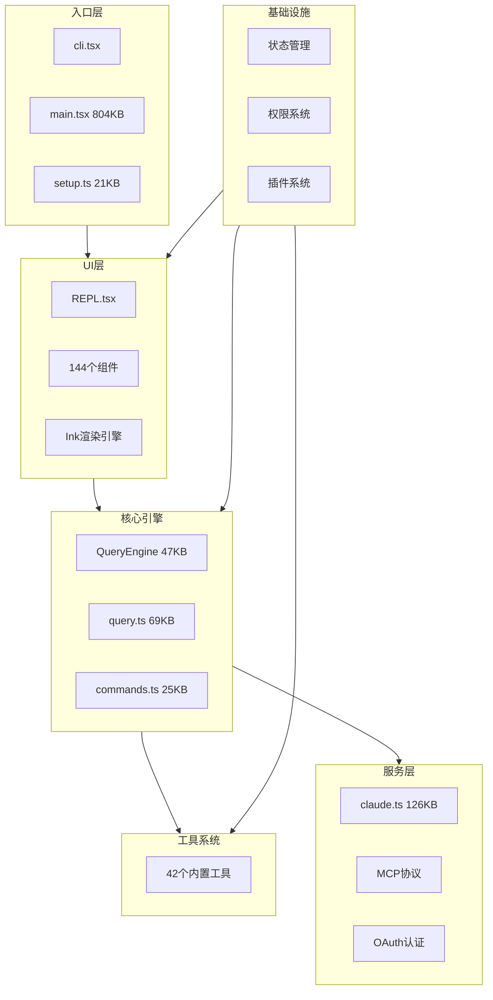
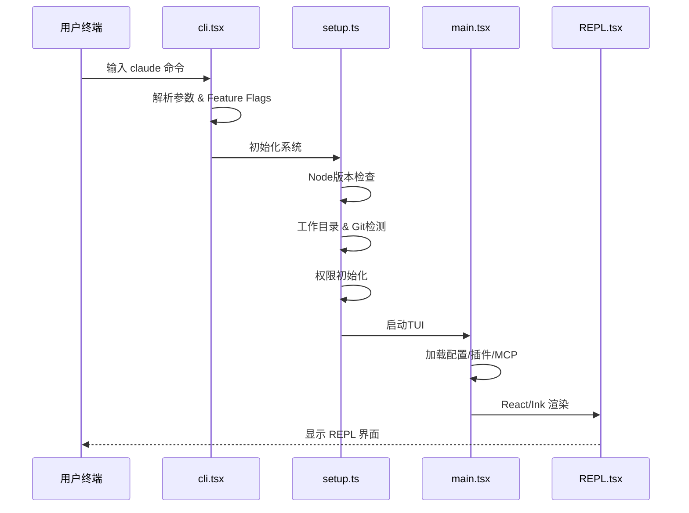
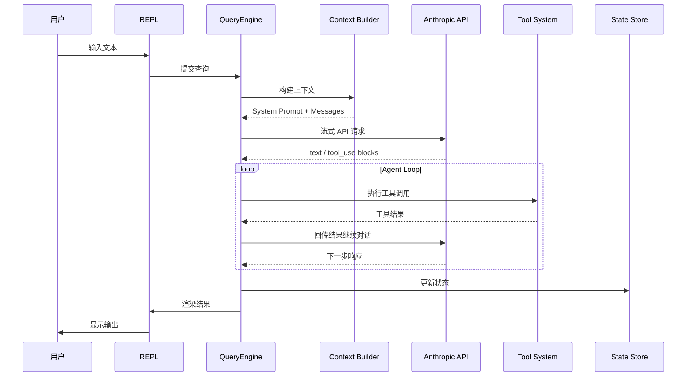
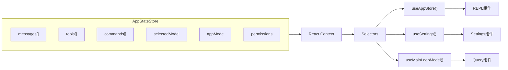
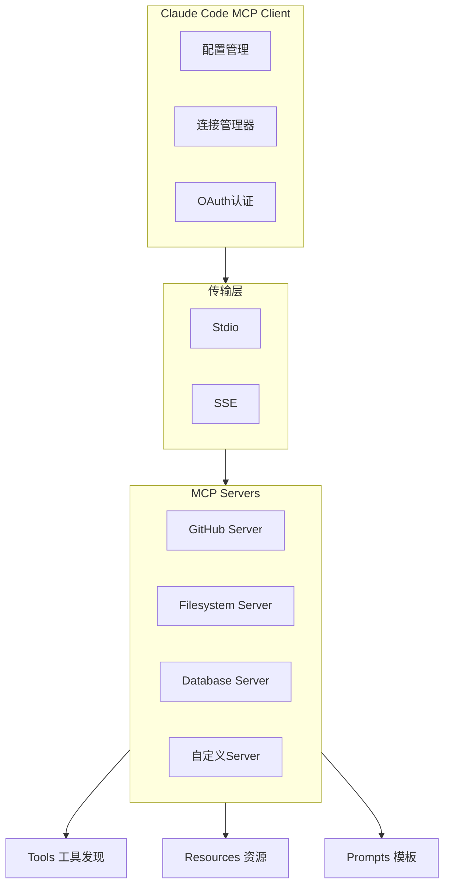
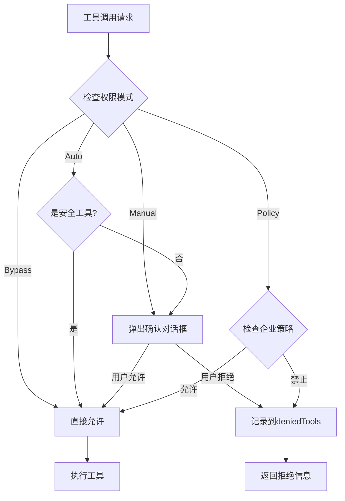

# Claude Code 项目架构图集

本文收录了 Claude Code 核心架构的所有关键图表，每张图配有简要说明。适合作为快速参考手册使用。

## 1. 整体架构图

Claude Code 采用六层架构设计，从用户终端到 Anthropic API 的完整技术栈。

## 2. 启动流程时序图

从用户在终端输入命令到 REPL 界面显示的完整启动链路。

## 3. 请求处理全流程

一次完整的用户请求从输入到响应的全链路。

## 4. 工具系统分类图

42个内置工具按功能分为6大类。

```mermaid
graph TB
    ROOT["42个内置工具"]
    
    ROOT --> FILE["文件操作 5个"]
    ROOT --> EXEC["执行工具 3个"]
    ROOT --> SEARCH["搜索工具 2个"]
    ROOT --> AGENT["智能体工具 4个"]
    ROOT --> MCPT["MCP工具 3个"]
    ROOT --> OTHER["其他工具 25个"]
    
    FILE --> FR["FileReadTool"]
    FILE --> FE["FileEditTool"]
    FILE --> FW["FileWriteTool"]
    FILE --> GL["GlobTool"]
    FILE --> GR["GrepTool"]
    
    EXEC --> BT["BashTool"]
    EXEC --> PS["PowerShellTool"]
    EXEC --> RP["REPLTool"]
    
    SEARCH --> WS["WebSearchTool"]
    SEARCH --> WF["WebFetchTool"]
    
    AGENT --> AT["AgentTool"]
    AGENT --> TC["TaskCreateTool"]
    AGENT --> SM["SendMessageTool"]
    AGENT --> AQ["AskUserQuestion"]
    
    MCPT --> MT["MCPTool"]
    MCPT --> LR["ListMcpResources"]
    MCPT --> RR["ReadMcpResource"]
```

## 5. 状态管理架构图

类 Zustand 的轻量级状态管理方案。

## 6. MCP 协议交互图

Model Context Protocol 的客户端-服务器交互架构。

## 7. 权限检查流程图

工具执行前的权限验证链路。

## 核心文件大小参考

| 文件 | 大小 | 职责 |
|------|------|------|
| main.tsx | 804 KB | CLI主程序 |
| claude.ts | 126 KB | API客户端 |
| ConsoleOAuthFlow.tsx | 80 KB | OAuth界面 |
| ContextVisualization.tsx | 76 KB | Token可视化 |
| query.ts | 69 KB | 请求处理 |
| interactiveHelpers.tsx | 57 KB | 交互帮助 |
| QueryEngine.ts | 47 KB | 执行引擎 |
| Tool.ts | 30 KB | 工具定义 |
| commands.ts | 25 KB | 命令注册 |
| setup.ts | 21 KB | 初始化 |

这些架构图完整呈现了 Claude Code 从宏观到微观的技术设计全貌。
