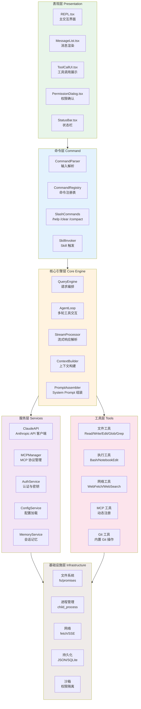
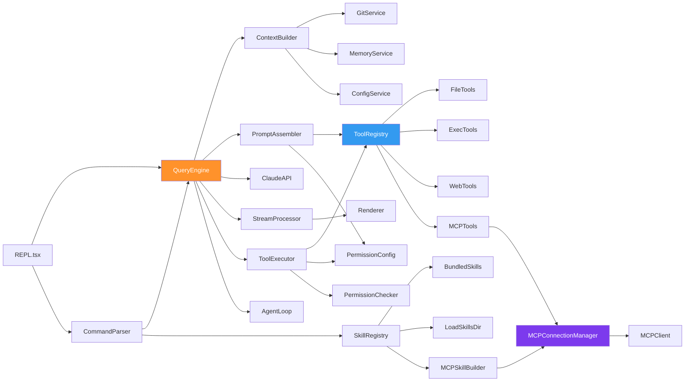
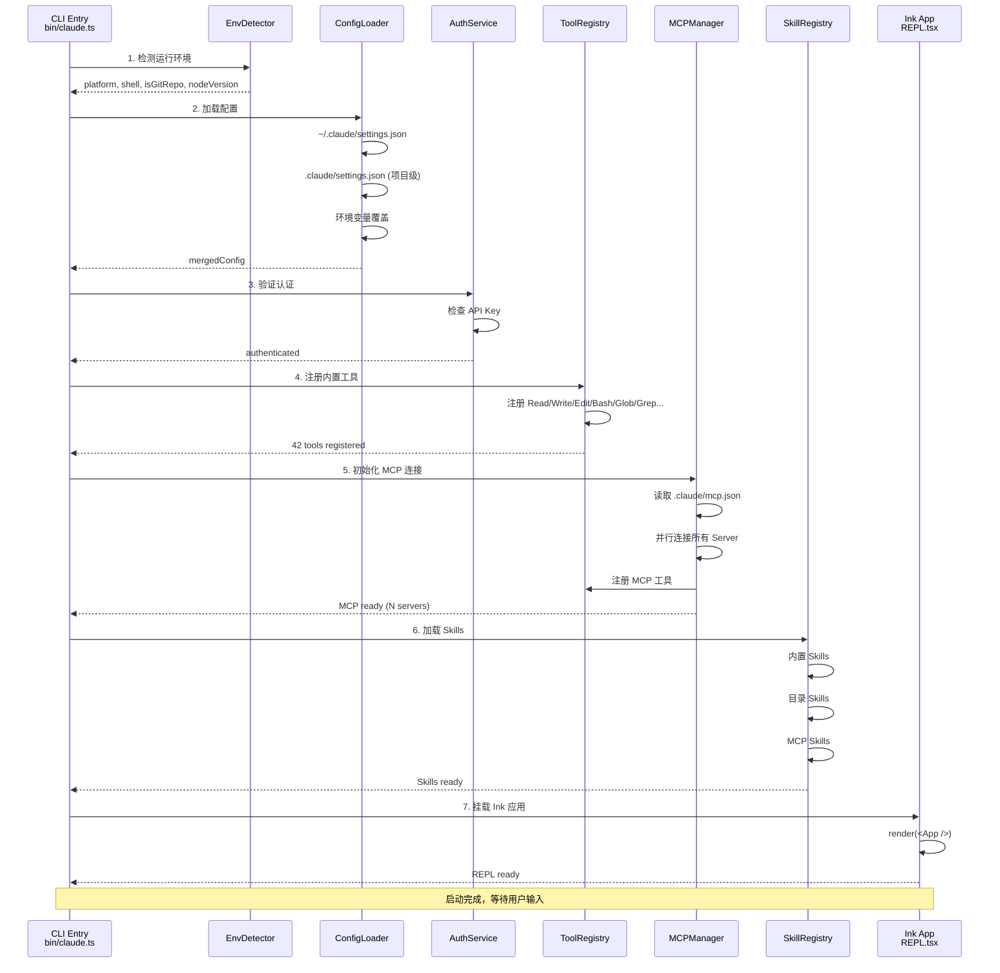
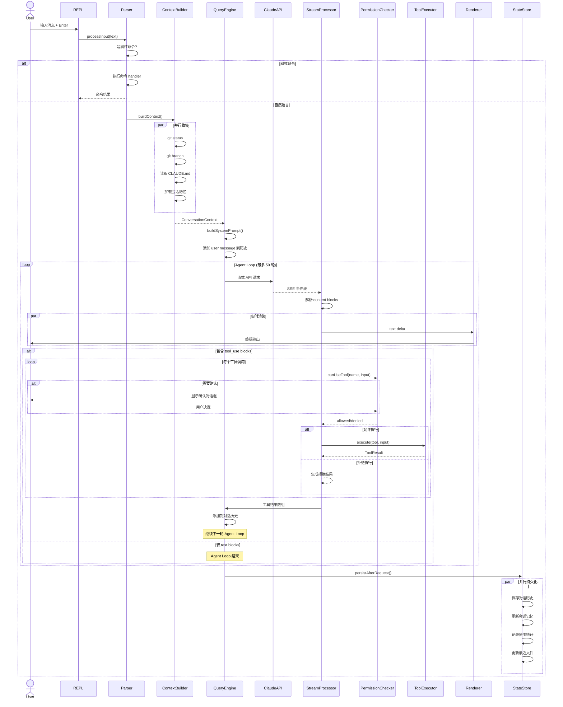
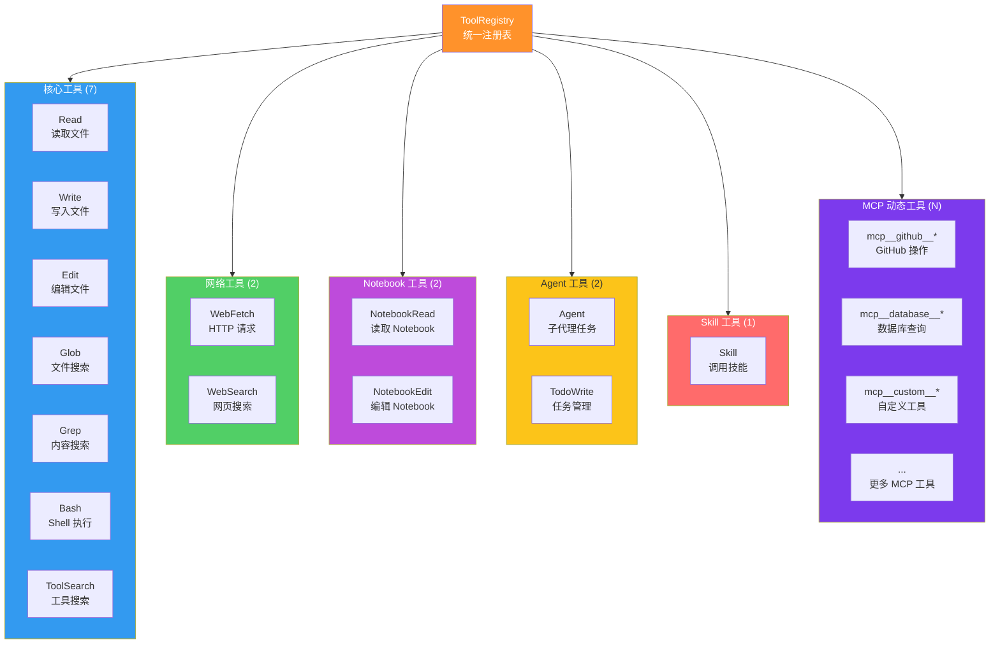
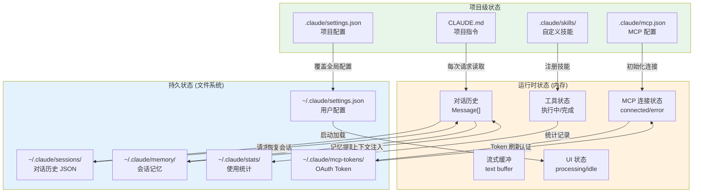
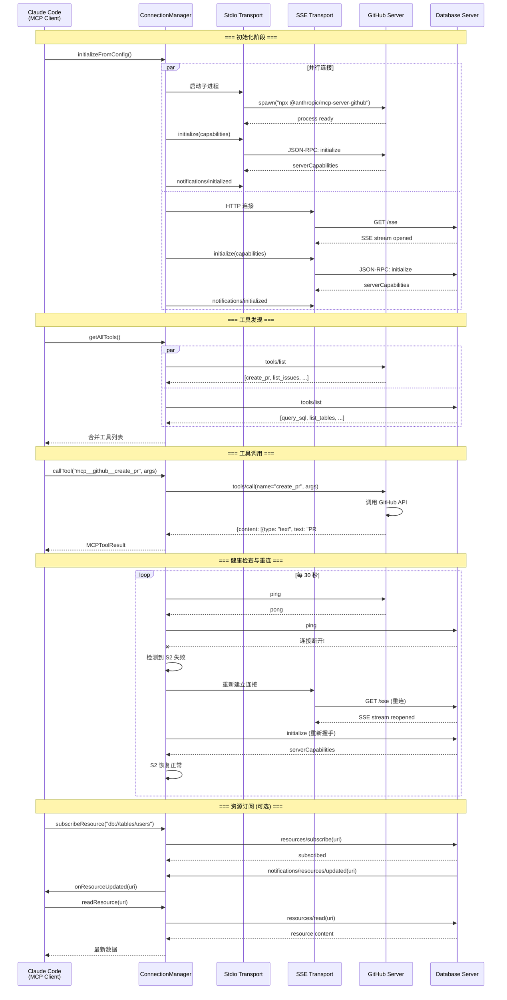

# Claude Code 项目架构图集

本文是 Claude Code 架构系列的可视化参考手册。七张核心架构图，覆盖从整体分层到细节交互的全部关键视角。每张图附带简要说明，帮助你快速建立对系统的直觉认知。

建议收藏本文，在阅读其他文章时随时回来对照。

---

## 1. 整体架构图（六层分层）

Claude Code 采用经典的分层架构，从上到下分为表现层、命令层、核心引擎层、服务层、工具层和基础设施层。每一层只依赖其下方的层，确保关注点分离。

---

## 2. 模块依赖图

这张图展示了核心模块之间的 import 依赖关系。箭头方向表示"依赖于"。可以看到 QueryEngine 是依赖最密集的模块，它是整个系统的编排中心。

---

## 3. 启动流程图

Claude Code 的启动过程分为五个阶段：环境检测、配置加载、服务初始化、MCP 连接和 UI 挂载。整个过程在约 1-3 秒内完成。

---

## 4. 请求流程图（完整版）

这是最详细的请求流程图，展示了从用户输入到最终渲染的全部参与者和交互。特别注意 Agent Loop 部分——它是 Claude Code 自主完成复杂任务的核心机制。

---

## 5. 工具系统图（按类别分组）

Claude Code 内置了 42 个工具，按功能分为六大类。MCP 工具是动态注册的，数量取决于连接了多少 MCP Server。

---

## 6. 状态管理图

Claude Code 的状态分布在多个层级：运行时状态在内存中，持久状态写入文件系统。这张图展示了各状态的数据流向。

---

## 7. MCP 协议交互图

这张图展示了 Claude Code 作为 MCP Client 与多个 MCP Server 交互的完整生命周期，包括初始化握手、工具发现、工具调用和错误恢复。

---

## 图集使用建议

这七张图覆盖了 Claude Code 架构的不同维度：

| 图表 | 回答的问题 |
|------|-----------|
| 整体架构图 | 系统由哪些层组成？各层的职责是什么？ |
| 模块依赖图 | 改动一个模块会影响哪些其他模块？ |
| 启动流程图 | 从命令行启动到 REPL 就绪经历了什么？ |
| 请求流程图 | 一个用户请求的完整生命周期是怎样的？ |
| 工具系统图 | 有哪些工具可用？如何分类？ |
| 状态管理图 | 状态保存在哪里？如何流转？ |
| MCP 协议图 | 外部服务是如何接入的？ |

建议在以下场景回顾对应的图表：

- **开始贡献代码**：先看整体架构图和模块依赖图，了解改动的影响范围
- **调试问题**：对照请求流程图，定位问题出在哪个环节
- **开发扩展**：参考工具系统图和 MCP 协议图，选择合适的扩展方式
- **优化性能**：结合启动流程图和状态管理图，找到瓶颈点

架构图不是文档的终点，而是理解系统的起点。带着这些图去阅读源码，你会发现一切都变得清晰了。
